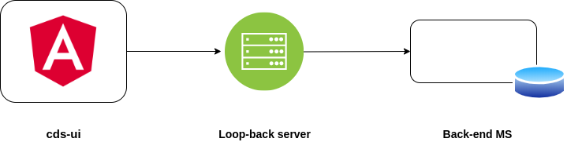

### Format code with ktlint checkstyle tool use the following command
`mvn process-sources -P format`

**Reference:** [ktlint docs](https://ktlint.github.io/) | [ktlint codebase](https://github.com/pinterest/ktlint)

## Basic Architecture

## Basic Requirements
Before you can build this project, you must install and configure the following dependencies on your machine:
  1) Java 11 SDK
  2) Maven 3.6.X
  3) MySQL Database
  4) Node and npm installed
  5) Angular CLI & Angular v8

## Running in Development Mode
Running `mvn clean install` command to install all libraries and dependencies for the maven and npm.
Running `mvn clean install -Pdocker` command to install all libraries and create below docker images.
  * ccsdk-blueprintsprocessor
  * ccsdk-commandexecutor
  * ccsdk-py-executor
  * ccsdk-sdclistener
  * ccsdk-cds-ui-server
  * ccsdk-cds-ui

**Note:** run `mvn clean install -Pdocker -Ddocker.skip.push=true` to build but skip pushing docker image.

1) Back-end MS
   >Create `sdnctl` table in MySQL 
   >(Optional) You could run the project in a specific profile(dev, local) by adding `-Dspring.profiles.active=profile-name`
  
2) Loop-back server: 
   >That allow your request to reach the backend from cds-ui 
   >Move to `./cds-ui/server/` folder and run the  command `npm start`
 
3) cds-ui
   >Move to `./cds-ui/designer-client/` folder and run the command `npm start` 
   >This command will make sure all the files follow the linting rules and then connect to the loopback server.

## Using an IDE
**Front-end:** you could use `vscode` or `webstorm` 
**Back-end:** `IntelliJ` with kotlin plugin or any other editor

---
For more information check: [CDS Docs](https://docs.onap.org/projects/onap-ccsdk-cds/en/latest/index.html)