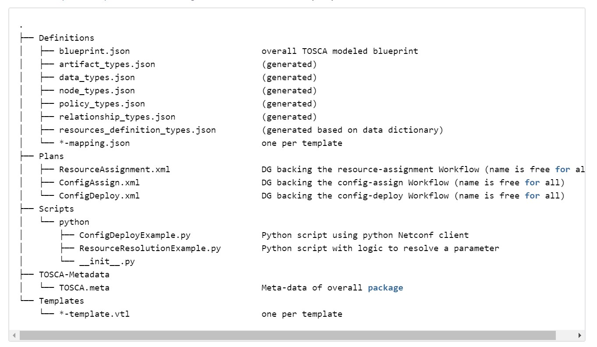
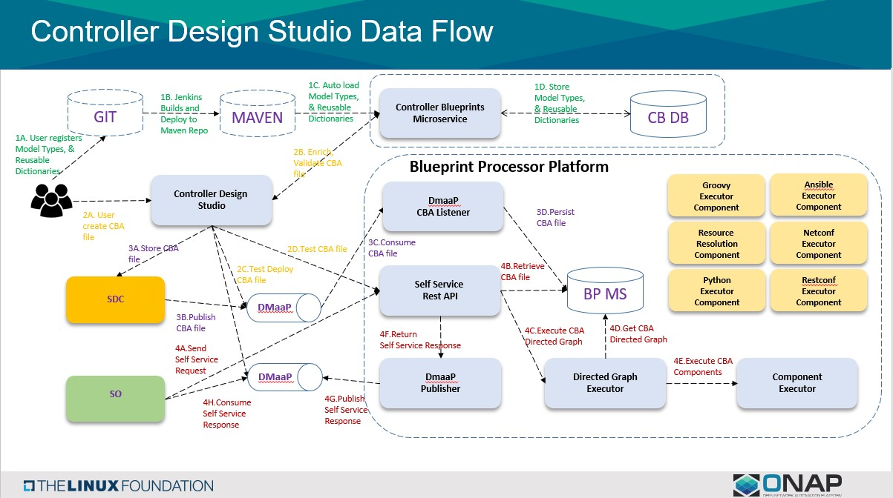
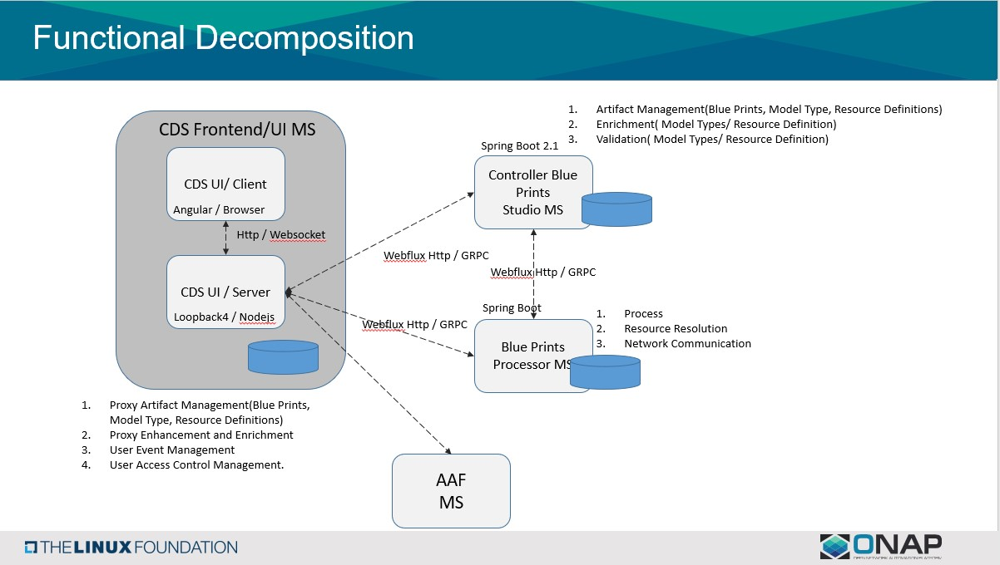

.. This work is licensed under a Creative Commons Attribution 4.0 International License.
.. http://creativecommons.org/licenses/by/4.0
.. Copyright (C) 2019 IBM.

Controller Blueprint Archived Tool(CBA)
----------------------------------------
.. toctree::
   :maxdepth: 1
   
Introduction:
=============
The Controller Blueprint Archived is the overall service design, fully model-driven, package needed to automate the resolution of resources for instantiation and any config provisioning operation, such as day0, day1 or day2 configuration.

The CBA is .zip file, comprised of the following folder structure, the files may vary:

|image0|

Architecture:
=============

|image3|

.. |image3| image:: media/CDS_architecture.jpg
   :height: 4.43750in
   :width: 7.88889in
   
Installation:
=============

.. toctree::
   :maxdepth: 1
   :glob:
   
   sections/installation/index
   
Development:
=============

.. toctree::
   :maxdepth: 1
   :glob:
   
   sections/development/index
   
Data Flow:
==========
|image1|

   
Functional Decomposition:
=========================
|image2|

   
Controller design Studio Presentation:
======================================

Details about CDS Architecture and Design detail, Please click the link.
:download:`CDS_Architecture_Design.pptx`