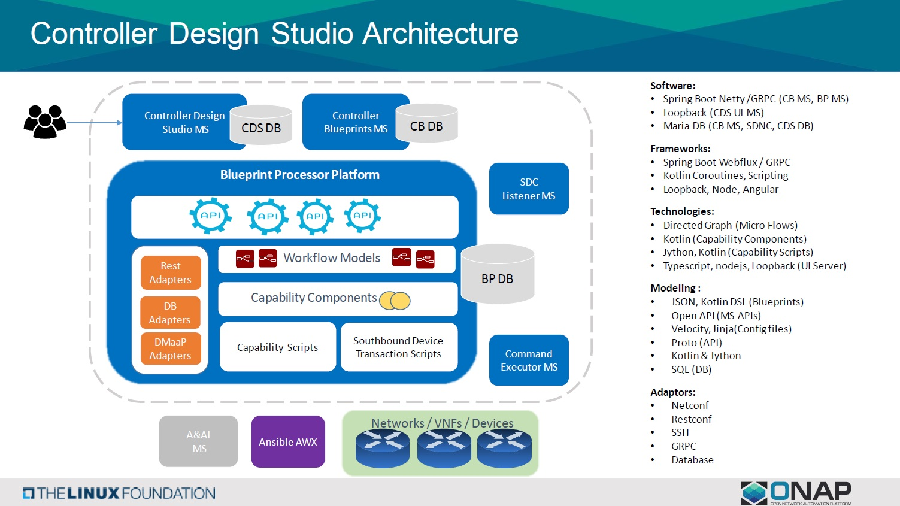
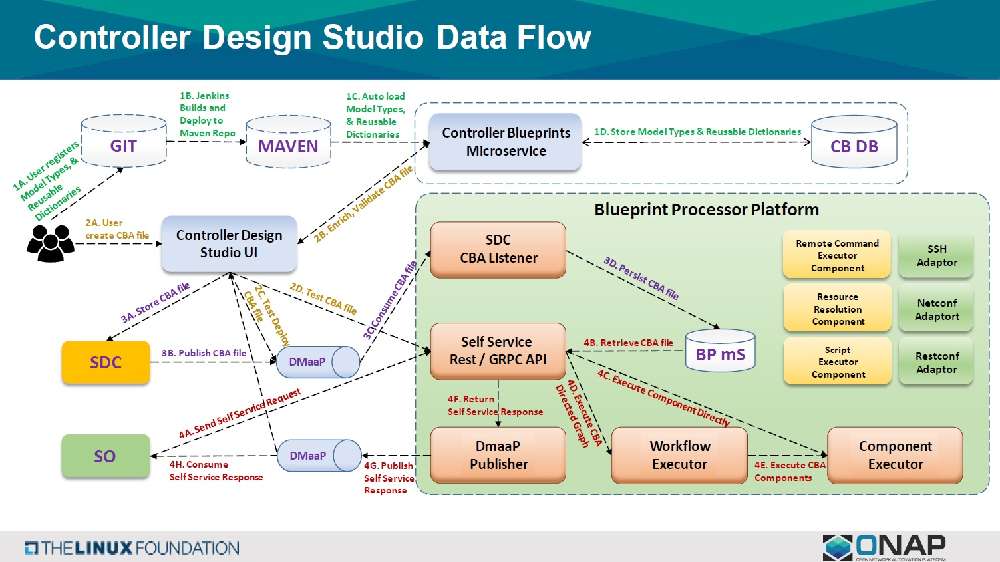
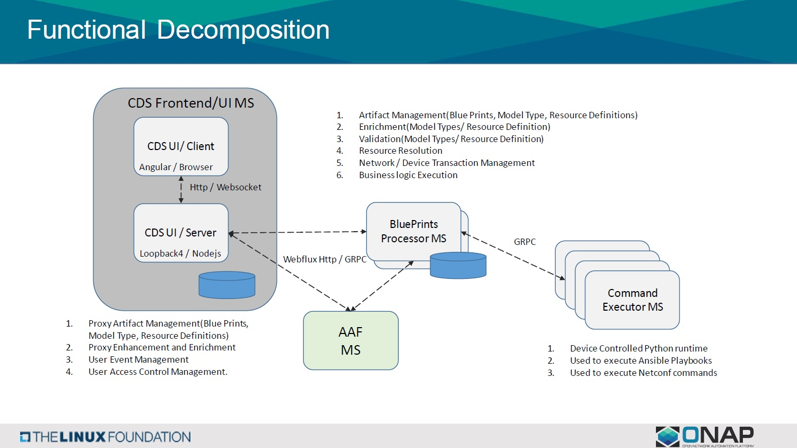

.. This work is licensed under a Creative Commons Attribution 4.0
.. International License. http://creativecommons.org/licenses/by/4.0
.. Copyright (C) 2019 IBM.

.. _cds_cba-doc:

Controller Blueprint Archived Designer Tool (CBA)
=================================================
.. toctree::
   :maxdepth: 1

Introduction
------------
The **C**\ ontroller **B**\ lueprint **A**\ rchive is the overall service design, fully model-driven, intent based
**package** needed for SELF SERVICE provisioning and configuration management automation.

The CBA is **.zip** file, comprised of the following folder structure, the files may vary:

.. code-block language is required for ReadTheDocs to render code-blocks. Python set as default.

.. code-block:: python

    ├── Definitions
    │   ├── blueprint.json                          Overall TOSCA service template (workflow + node_template)
    │   ├── artifact_types.json                     (generated by enrichment)
    │   ├── data_types.json                         (generated by enrichment)
    │   ├── policy_types.json                       (generated by enrichment)
    │   ├── node_types.json                         (generated by enrichment)
    │   ├── relationship_types.json                 (generated by enrichment)
    │   ├── resources_definition_types.json         (generated by enrichment, based on Data Dictionaries)
    │   └── *-mapping.json                          One per Template
    │
    ├── Environments                                Contains *.properties files as required by the service
    │
    ├── Plans                                       Contains Directed Graph
    │
    ├── Tests                                       Contains uat.yaml file for testing cba actions within a cba package
    │
    ├── Scripts                                     Contains scripts
    │   ├── python                                  Python scripts
    │   └── kotlin                                  Kotlin scripts
    │
    ├── TOSCA-Metadata
    │   └── TOSCA.meta                              Meta-data of overall package
    │
    └── Templates                                   Contains combination of mapping and template

To process a CBA for any service we need to enrich it first. This will gather all the node- type, data-type,
artifact-type, data-dictionary definitions provided in the blueprint.json.

Architecture
------------
|image1|

Data Flow
---------
|image2|

Installation
------------

Building client html and js files
.................................

   * FROM alpine:3.8 as builder
   * RUN apk add --no-cache npm
   * WORKDIR /opt/cds-ui/client/
   * COPY client/package.json /opt/cds-ui/client/
   * RUN npm install
   * COPY client /opt/cds-ui/client/
   * RUN npm run build

Building and creating server
............................

   * FROM alpine:3.8
   * WORKDIR /opt/cds-ui/
   * RUN apk add --no-cache npm
   * COPY server/package.json /opt/cds-ui/
   * RUN npm install
   * COPY server /opt/cds-ui/
   * COPY --from=builder /opt/cds-ui/server/public /opt/cds-ui/public
   * RUN npm run build
   * EXPOSE 3000
   * CMD [ "npm", "start" ]

Development
-----------

Pre-requiste
............
   * Visual Studio code editor
   * Git bash
   * Node.js & npm
   * loopback 4 cl

Steps
.....
   To compile CDS code:

   1. Make sure your local Maven settings file ($HOME/.m2/settings.xml)
      contains references to the ONAP repositories and OpenDaylight
      repositories.
   2. git clone https://(LFID)@gerrit.onap.org/r/a/ccsdk/cds
   3. cd cds ; mvn clean install ; cd ..
   4. Open the cds-ui/client code for development

Functional Decomposition
------------------------
|image3|

