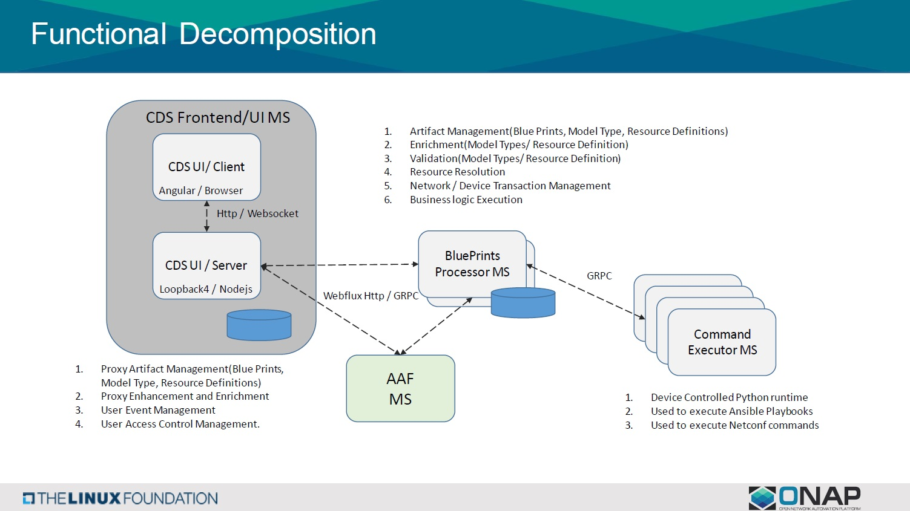

.. This work is licensed under a Creative Commons Attribution 4.0
.. International License. http://creativecommons.org/licenses/by/4.0
.. Copyright (C) 2019 IBM.

.. _cds_cba-doc:

Controller Blueprint Archived Designer Tool (CBA)
=================================================
.. toctree::
   :maxdepth: 1

Introduction
------------

.. include:: cba-description.rst

Architecture
------------
|image1|

Data Flow
---------
|image2|

Installation
------------

Building client html and js files
.................................

   * FROM alpine:3.8 as builder
   * RUN apk add --no-cache npm
   * WORKDIR /opt/cds-ui/client/
   * COPY client/package.json /opt/cds-ui/client/
   * RUN npm install
   * COPY client /opt/cds-ui/client/
   * RUN npm run build

Building and creating server
............................

   * FROM alpine:3.8
   * WORKDIR /opt/cds-ui/
   * RUN apk add --no-cache npm
   * COPY server/package.json /opt/cds-ui/
   * RUN npm install
   * COPY server /opt/cds-ui/
   * COPY --from=builder /opt/cds-ui/server/public /opt/cds-ui/public
   * RUN npm run build
   * EXPOSE 3000
   * CMD [ "npm", "start" ]

Development
-----------

Pre-requiste
............
   * Visual Studio code editor
   * Git bash
   * Node.js & npm
   * loopback 4 cl

Steps
.....
   To compile CDS code:

   1. Make sure your local Maven settings file ($HOME/.m2/settings.xml)
      contains references to the ONAP repositories and OpenDaylight
      repositories.
   2. git clone https://(LFID)@gerrit.onap.org/r/a/ccsdk/cds
   3. cd cds ; mvn clean install ; cd ..
   4. Open the cds-ui/client code for development

Functional Decomposition
------------------------
|image3|

.. |image2| image:: media/CDS_Data_Flow.jpg
   :width: 500pt

