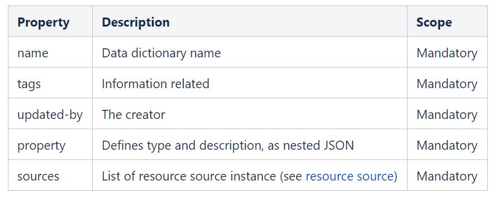
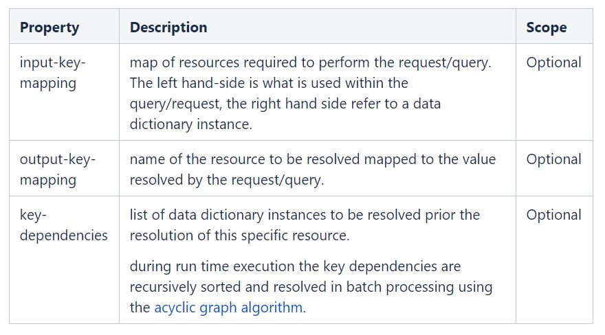

.. This work is licensed under a Creative Commons Attribution 4.0 International License.
.. http://creativecommons.org/licenses/by/4.0
.. Copyright (C) 2019 IBM.

Resource Definition
-------------------
.. toctree::
   :maxdepth: 1

Introduction:
=============
A Resource definition models the how a specific resource can be resolved.

A resource is a variable/parameter in the context of the service. It can be anything, but it should not be confused with SDC or Openstack resources.

A Resource definition can have multiple sources to handle resolution in different ways. The main goal of Resource definition is to define re-usable entity that could be shared.

Creation of Resource definition is a standalone activity, separated from the blueprint design.

As part of modelling a Resource definition entry, the following generic information should be provided:

|image0|

Below are properties that all the resource source have will have

The modeling does allow for data translation between external capability and CDS for both input and output key mapping.

|image1|

Example:
========

vf-module-model-customization-uuid and vf-module-label are two data dictionaries. A SQL table, VF_MODULE_MODEL, exist to correlate them.

Here is how input-key-mapping, output-key-mapping and key-dependencies can be used:

.. toctree::
   :maxdepth: 1

   resourcedefinitioncodesnip

Resource source:
================

Defines the contract to resolve a resource.

A resource source is modeled, following TOSCA_ node type definition and derives from the Resource_ source.

Also please click below for resource source available details

.. toctree::
   :maxdepth: 1

   resourcesource

.. _TOSCA: http://docs.oasis-open.org/tosca/TOSCA-Simple-Profile-YAML/v1.0/csprd01/TOSCA-Simple-Profile-YAML-v1.0-csprd01.html#DEFN_ENTITY_NODE_TYPE
.. _Resource: https://wiki.onap.org/display/DW/Modeling+Concepts#ModelingConcepts-NodeResourceSource

