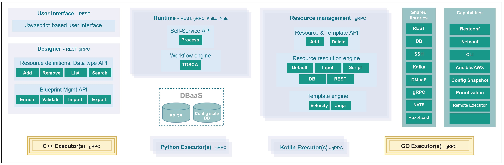

.. This work is licensed under a Creative Commons Attribution 4.0
.. International License. http://creativecommons.org/licenses/by/4.0
.. Copyright (C) 2019 IBM.
.. _master_index:

.. _cds_main-doc:

CONTROLLER DESIGN STUDIO (CDS)
==============================
.. toctree::
   :maxdepth: 1

Introduction
------------
    The system is designed to be self service, which means that users, not just
programmers, can reconfigure the software system as needed to meet customer
requirements. To accomplish this goal, the system is built around models that
provide for real-time changes in how the system operates.  Users merely need
to change a model to change how a service operates.

    Self service is a completely new way of delivering services.  It removes the
dependence on code releases and the delays they cause and puts the control of
services into the hands of the service providers.  They can change a model and
its parameters and create a new service without writing a single line of code.
This makes SERVICE PROVIDER(S) more responsive to its customers and able to
deliver products that more closely match the needs of its customers.

Architecture
------------
The Controller Design Studio is composed of two major components:
   * The GUI (or frontend)
   * The Run Time (or backend)

    The GUI handles direct user input and allows for displaying both design time
and run time activities. For design time, it allows for the creation of
controller blueprint, from selecting the DGs to be included, to incorporating
the artifact templates, to adding necessary components.  For run time, it
allows the user to direct the system to resolve the unresolved elements of the
controller blueprint and download the resulting configuration into a VNF.

    At a more basic level, it allows for creation of data dictionaries,
capabilities catalogs, and controller blueprint, the basic elements that are
used to generate a configuration. The essential function of the Controller
Design Studio is to create and populate a controller blueprint, create a
configuration file from this Controller blueprint, and download this
configuration file (configlet) to a VNF/PNF.

|cdsArchitectureImage|

Modeling Concept
----------------

    In Dublin release, the CDS community has contributed a framework to automate
the resolution of resources for instantiation and any config provisioning
operation, such as day0, day1 or day2 configuration.

    The content of the CBA Package is driven from a catalog of reusable data
dictionary, component and workflow, delivering a reusable and simplified
self service experience.

TOSCA based JSON formatted model following standard:
http://docs.oasis-open.org/tosca/TOSCA-Simple-Profile-YAML/v1.2/csd01/TOSCA-Simple-Profile-YAML-v1.2-csd01.html

Most of the TOSCA modeled entity presented in the bellow documentation can
be found here:
https://github.com/onap/ccsdk-cds/tree/master/components/model-catalog/definition-type/starter-type

Tosca Model Reference:

|toscaModel|

Modeling Concept Links:
~~~~~~~~~~~~~~~~~~~~~~~

.. toctree::
   :maxdepth: 1

   modelingconcepts/overview
   microservices/controllerBlueprintMS
   microservices/blueprintsProcessorMS
   microservices/expression
   microservices/flexibleplugin

Scripts
-------

Library
~~~~~~~

* NetconfClient

    In order to facilitate NETCONF interaction within scripts, a python NetconfClient binded to our Kotlin implementation is made available. This NetconfClient can be used when using the component-netconf-executor.

    The client can be find here: https://github.com/onap/ccsdk-cds/blob/master/components/scripts/python/ccsdk_netconf/netconfclient.py

* ResolutionHelper

    When executing a component executor script, designer might want to perform
    resource resolution along with template meshing directly from the script
    itself.

    The helper can be found in below link:
    https://github.com/onap/ccsdk-apps/blob/master/components/scripts/python/ccsdk_netconf/common.py

.. |toscaModel| image:: media/tosca_model.jpg
   :width: 500pt

User Guide
----------

.. toctree::
   :maxdepth: 3

   userguide/developer-guide
   userguide/installation
   userguide/designtime

Use Cases
---------

.. toctree::
   :maxdepth: 2

   usecases/use-cases

CDS Designer UI
---------------

.. toctree::
   :maxdepth: 2

   ui/designer

Controller Design Studio Presentation
-------------------------------------

Details about CDS Architecture and Design detail, Please click the link.
:download:`CDS_Architecture_Design <media/CDS_Architecture_Design.pptx>`
