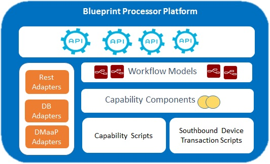

.. This work is licensed under a Creative Commons Attribution 4.0 International License.
.. http://creativecommons.
.. Copyright (C) 2019 IBM.

Blueprints Processor
====================

.. toctree::
   :maxdepth: 1
   :titlesonly:

Micro service to Manage Controller Blueprint Models, such as Resource Dictionary, Service Models, Velocity Templates etc,  which will serve service for Controller Design Studio and Controller runtimes.

This microservice is used to deploy Controller Blueprint Archive file in Run time database. This also helps to test the Valid Blueprint.

Architecture:
-------------

|image0|

Running Blueprints Processor Microservice Locally:
--------------------------------------------------

The purpose of this page is to show how to run the Blueprints Processor microservice locally, using the docker-compose.yaml file provided in the project.

Check out the CDS' code:

Check out the latest code from Gerrit: https://gerrit.onap.org/r/#/admin/projects/ccsdk/cds

Build CDS locally:
In the checked out directory, type

.. code-block:: none

   mvn clean install -DskipTests=true -Dmaven.test.skip=true -Dmaven.javadoc.skip=true -Dadditionalparam=-Xdoclint:none

Create the needed Docker images:

The Blueprints Processor microservice project has a module, called distribution, that provides a docker-compose.yaml file that can be used to spin up Docker containers to run this microservice.

The first step is to create any custom image needed, by building the distribution module.  From the CDS home directory (where the code was checked out), navigate to the module:

.. code-block:: none

   cd ms/blueprintsprocessor/distribution/

Build it using the Maven profile called Docker:

.. code-block:: none

   mvn clean install -Pdocker

Start Docker containers using docker-composer:
----------------------------------------------

Navigate to the docker-compose file in the distribution module:

.. code-block:: none

   cd src/main/dc/

From there, start the containers:

.. code-block:: none

   docker-compose up -d

This will spin the Docker containers declared inside the docker-compose.yaml file in the background.

To verify the logs generated by docker-composer, type:

.. code-block:: none

   docker-compose logs -f

Testing the environment:
------------------------

Point your browser to http://localhost:8000/api/v1/execution-service/ping (please note that the port is 8000, not 8080)

To authenticate, use login user id and password.