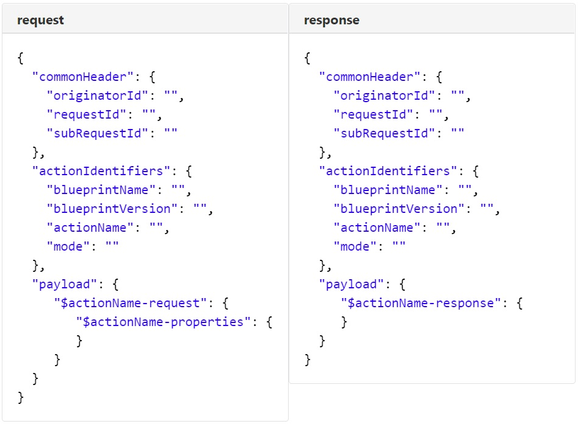

.. This work is licensed under a Creative Commons Attribution 4.0 International License.
.. http://creativecommons.org/licenses/by/4.0
.. Copyright (C) 2019 IBM.

Dynamic API
-----------

The nature of the API request and response is meant to be model driven and dynamic. They both share the same definition.

The actionName, under the actionIdentifiers refers to the name of a Workflow (see workflow)

The content of the payload is what is fully dynamic / model driven.

The first top level element will always be either $actionName-request for a request or $actionName-response for a response.

Then the content within this element is fully based on the workflow input and output.

Here is how the a generic request and response look like.

|image0|

