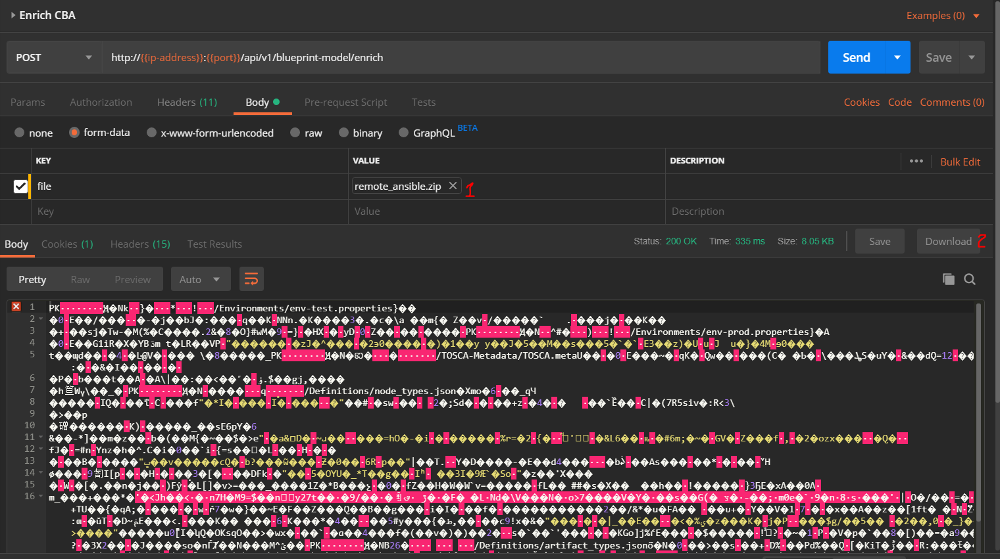
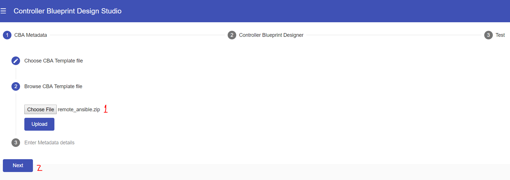
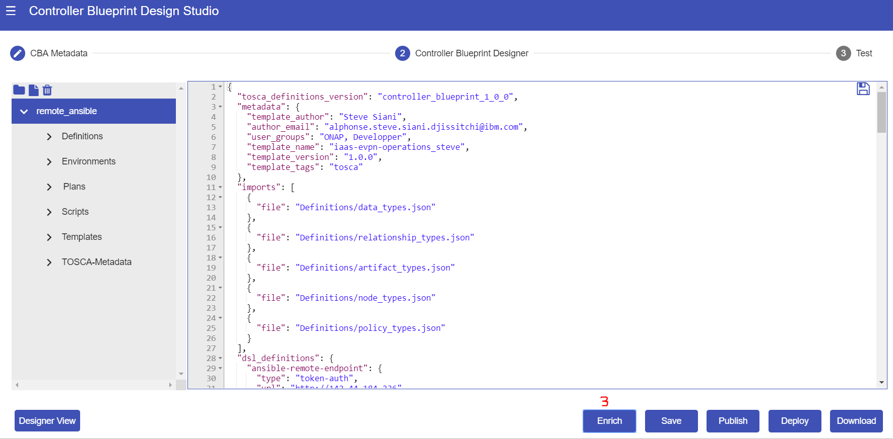

.. This work is licensed under a Creative Commons Attribution 4.0
.. International License. http://creativecommons.org/licenses/by/4.0
.. Copyright (C) 2019 IBM.

Enrichment
==========
.. toctree::
   :maxdepth: 1

Once the base CBA zip file is done, the enrichment process will complete the design by providing all the definitions required for the self-service provisioning.

The following shows 2 ways to run CBA enrichment

REST API request:
-----------------
|image0|

CDS UI:
-------
|image1|

|image2|

