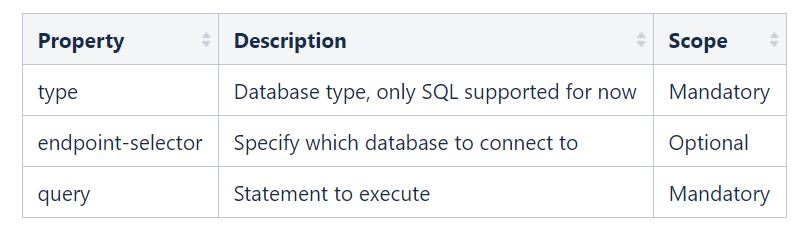
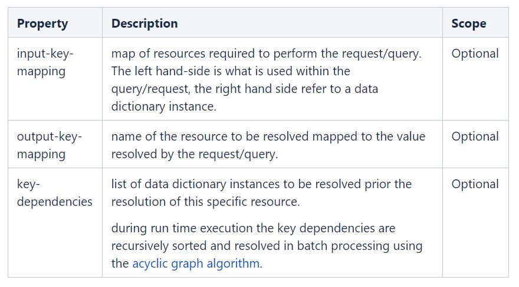
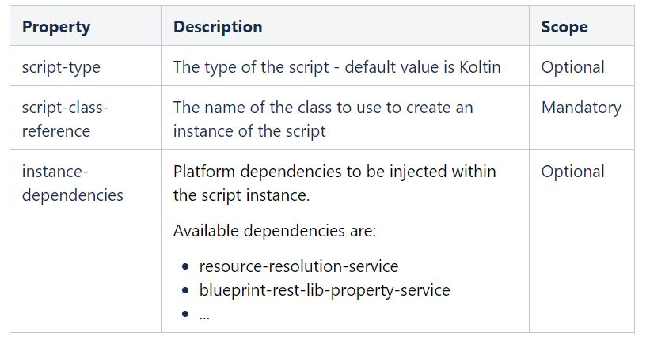

.. This work is licensed under a Creative Commons Attribution 4.0 International License.
.. http://creativecommons.org/licenses/by/4.0
.. Copyright (C) 2019 IBM.

Resource Source
===============
.. toctree::
   :maxdepth: 4

Input:
------
Expects the value to be provided as input to the request.

.. code-block:: json
   :linenos:

   {
     "source-input" :
     {
       "description": "This is Input Resource Source Node Type",
       "version": "1.0.0",
       "properties": {},
       "derived_from": "tosca.nodes.ResourceSource"
     }
   }

Default:
--------
Expects the value to be defaulted in the model itself.

.. code-block:: json
   :linenos:

   {
     "source-default" :
     {
       "description": "This is Default Resource Source Node Type",
       "version": "1.0.0",
       "properties": {},
       "derived_from": "tosca.nodes.ResourceSource"
     }
   }

Sql:
----

Expects the SQL query to be modeled; that SQL query can be parameterized, and the parameters be other resources resolved through other means. If that's the case, this data dictionary definition will have to define key-dependencies along with input-key-mapping.

CDS is currently deployed along the side of SDNC, hence the primary database connection provided by the framework is to SDNC database.

|image0|

.. code-block:: json
   :linenos:

    {
      "description": "This is Database Resource Source Node Type",
      "version": "1.0.0",
      "properties": {
        "type": {
          "required": true,
          "type": "string",
          "constraints": [
            {
              "valid_values": [
                "SQL"
              ]
            }
          ]
        },
        "endpoint-selector": {
          "required": false,
          "type": "string"
        },
        "query": {
          "required": true,
          "type": "string"
        },
        "input-key-mapping": {
          "required": false,
          "type": "map",
          "entry_schema": {
            "type": "string"
          }
        },
        "output-key-mapping": {
          "required": false,
          "type": "map",
          "entry_schema": {
            "type": "string"
          }
        },
        "key-dependencies": {
          "required": true,
          "type": "list",
          "entry_schema": {
            "type": "string"
          }
        }
      },
      "derived_from": "tosca.nodes.ResourceSource"
    }

Connection to a specific database can be expressed through the endpoint-selector property, which refers to a macro defining the information about the database the connect to. Understand TOSCA Macro in the context of CDS.

.. code-block:: json
   :linenos:

   {
     "dsl_definitions": {
       "dynamic-db-source": {
         "type": "maria-db",
         "url": "jdbc:mysql://localhost:3306/sdnctl",
         "username": "<username>",
         "password": "<password>"
       }
     }
   }

Rest:
-----

Expects the URI along with the VERB and the payload, if needed.

CDS is currently deployed along the side of SDNC, hence the default rest connection provided by the framework is to SDNC MDSAL.

|image1|

.. code-block:: json
   :linenos:

    {
      "description": "This is Rest Resource Source Node Type",
      "version": "1.0.0",
      "properties": {
        "type": {
          "required": false,
          "type": "string",
          "default": "JSON",
          "constraints": [
            {
              "valid_values": [
                "JSON"
              ]
            }
          ]
        },
        "verb": {
          "required": false,
          "type": "string",
          "default": "GET",
          "constraints": [
            {
              "valid_values": [
                "GET", "POST", "DELETE", "PUT"
              ]
            }
          ]
        },
        "payload": {
          "required": false,
          "type": "string",
          "default": ""
        },
        "endpoint-selector": {
          "required": false,
          "type": "string"
        },
        "url-path": {
          "required": true,
          "type": "string"
        },
        "path": {
          "required": true,
          "type": "string"
        },
        "expression-type": {
          "required": false,
          "type": "string",
          "default": "JSON_PATH",
          "constraints": [
            {
              "valid_values": [
                "JSON_PATH",
                "JSON_POINTER"
              ]
            }
          ]
        },
        "input-key-mapping": {
          "required": false,
          "type": "map",
          "entry_schema": {
            "type": "string"
          }
        },
        "output-key-mapping": {
          "required": false,
          "type": "map",
          "entry_schema": {
            "type": "string"
          }
        },
        "key-dependencies": {
          "required": true,
          "type": "list",
          "entry_schema": {
            "type": "string"
          }
        }
      },
      "derived_from": "tosca.nodes.ResourceSource"
    }

Connection to a specific REST system can be expressed through the endpoint-selector property, which refers to a macro defining the information about the REST system the connect to. Understand TOSCA Macro in the context of CDS.

Few ways are available to authenticate to the REST system:
    * token-auth
    * basic-auth
    * ssl-basic-auth

token-auth:
~~~~~~~~~~~

.. code-block:: json
   :linenos:

   {
     "dsl_definitions": {
       "dynamic-rest-source": {
         "type" : "token-auth",
         "url" : "http://localhost:32778",
         "token" : "<token>"
       }
     }
   }

basic-auth:
~~~~~~~~~~~

.. code-block:: json
   :linenos:

   {
     "dsl_definitions": {
       "dynamic-rest-source": {
         "type" : "basic-auth",
         "url" : "http://localhost:32778",
         "username" : "<username>",
         "password": "<password>"
       }
     }
   }

ssl-basic-auth:
~~~~~~~~~~~~~~~

.. code-block:: json
   :linenos:

   {
     "dsl_definitions": {
       "dynamic-rest-source": {
         "type" : "ssl-basic-auth",
         "url" : "http://localhost:32778",
         "keyStoreInstance": "JKS or PKCS12",
         "sslTrust": "trusture",
         "sslTrustPassword": "<password>",
         "sslKey": "keystore",
         "sslKeyPassword": "<password>"
       }
     }
   }

Capability:
-----------

Expects a script to be provided.

|image2|

.. code-block:: json
   :linenos:

    {
      "description": "This is Component Resource Source Node Type",
      "version": "1.0.0",
      "properties": {
        "script-type": {
          "required": true,
          "type": "string",
          "default": "kotlin",
          "constraints": [
            {
              "valid_values": [
                "kotlin",
                "jython"
              ]
            }
          ]
        },
        "script-class-reference": {
          "description": "Capability reference name for internal and kotlin, for jython script file path",
          "required": true,
          "type": "string"
        },
        "instance-dependencies": {
          "required": false,
          "description": "Instance dependency Names to Inject to Kotlin / Jython Script.",
          "type": "list",
          "entry_schema": {
            "type": "string"
          }
        },
        "key-dependencies": {
          "description": "Resource Resolution dependency dictionary names.",
          "required": true,
          "type": "list",
          "entry_schema": {
            "type": "string"
          }
        }
      },
      "derived_from": "tosca.nodes.ResourceSource"
    }

Complex Type:
-------------

Value will be resolved through REST., and output will be a complex type.

Modeling reference: Modeling Concepts#rest

In this example, we're making a POST request to an IPAM system with no payload.

Some ingredients are required to perform the query, in this case, $prefixId. Hence It is provided as an input-key-mapping and defined as a key-dependencies. Please refer to the modeling guideline for more in depth understanding.

As part of this request, the expected response will be as below.

.. code-block:: json
   :linenos:

    {
      "id": 4,
      "address": "192.168.10.2/32",
      "vrf": null,
      "tenant": null,
      "status": 1,
      "role": null,
      "interface": null,
      "description": "",
      "nat_inside": null,
      "created": "2018-08-30",
      "last_updated": "2018-08-30T14:59:05.277820Z"
    }

What is of interest is the address and id fields. For the process to return these two values, we need to create a custom data-type, as bellow

.. code-block:: json
   :linenos:

   {
     "version": "1.0.0",
     "description": "This is Netbox IP Data Type",
     "properties": {
       "address": {
         "required": true,
         "type": "string"
       },
       "id": {
         "required": true,
         "type": "integer"
       }
     },
     "derived_from": "tosca.datatypes.Root"
   }

The type of the data dictionary will be dt-netbox-ip.

To tell the resolution framework what is of interest in the response, the output-key-mapping section is used. The process will map the output-key-mapping to the defined data-type.

.. code-block:: json

     {
       "tags" : "oam-local-ipv4-address",
       "name" : "create_netbox_ip",
       "property" : {
         "description" : "netbox ip",
         "type" : "dt-netbox-ip"
       },
       "updated-by" : "adetalhouet",
       "sources" : {
         "config-data" : {
           "type" : "source-rest",
           "properties" : {
             "type" : "JSON",
             "verb" : "POST",
             "endpoint-selector" : "ipam-1",
             "url-path" : "/api/ipam/prefixes/$prefixId/available-ips/",
             "path" : "",
             "input-key-mapping" : {
               "prefixId" : "prefix-id"
             },
             "output-key-mapping" : {
               "address" : "address",
               "id" : "id"
             },
             "key-dependencies" : [ "prefix-id" ]
           }
         }
       }
     }