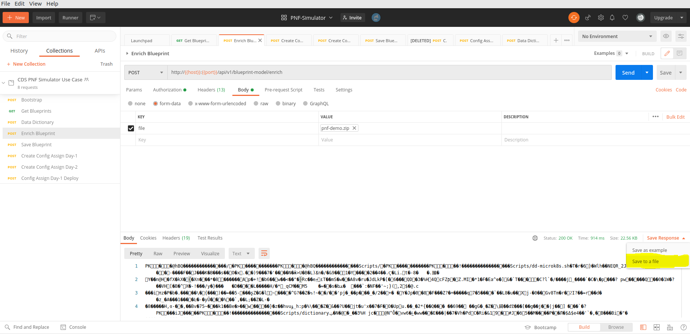

.. This work is a derivative of https://wiki.onap.org/display/DW/PNF+Simulator+Day-N+config-assign+and+config-deploy+use+case
.. This work is licensed under a Creative Commons Attribution 4.0
.. International License. http://creativecommons.org/licenses/by/4.0
.. Copyright (C) 2020 Deutsche Telekom AG.

PNF Simulator Day-N config-assign/deploy
========================================

Overview
~~~~~~~~~~

This use case shows in a very simple way how a blueprint model of a PNF is created in CDS and how the day-n configuration is
assigned and deployed through CDS. A Netconf server (docker image `sysrepo/sysrepo-netopeer2`) is used for simulating the PNF.

This use case (POC) solely requires a running CDS and the PNF Simulator running on a VM (Ubuntu is used by the author).
No other module of ONAP is needed.

There are different ways to run CDS, to run PNF simulator and to do configuration deployment. This guide will show
different possible options to allow the greatest possible flexibility.

Run CDS (Blueprint Processor)
~~~~~~~~~~~~~~~~~~~~~~~~~~~~~~~~~

CDS can be run in Kubernetes (Minikube, Microk8s) or in an IDE. You can choose your favorite option.
Just the blueprint processor of CDS is needed. If you have desktop access it is recommended to run CDS in an IDE since
it is easy and enables debugging.

* CDS in Microk8s: https://wiki.onap.org/display/DW/Running+CDS+on+Microk8s (RDT link to be added)
* CDS in Minikube: https://wiki.onap.org/display/DW/Running+CDS+in+minikube (RDT link to be added)
* CDS in an IDE:  https://docs.onap.org/projects/onap-ccsdk-cds/en/latest/userguide/running-bp-processor-in-ide.html

After CDS is running remember the port of blueprint processor, you will need it later on.

Run PNF Simulator and install module
~~~~~~~~~~~~~~~~~~~~~~~~~~~~~~~~~~~~

There are many different ways to run a Netconf Server to simulate the PNF, in this guide `sysrepo/sysrepo-netopeer2`
docker image is commonly used. The easiest way is to run the out-of-the-box docker container without any
other configuration, modules or scripts. In the ONAP community there are other workflows existing for running the
PNF Simulator. These workflows are also using `sysrepo/sysrepo-netopeer2` docker image. These workflow are also linked
here but they are not tested by the author of this guide.

.. tabs::

   .. tab:: sysrepo/sysrepo-netopeer2 (latest)

      .. warning::
         Currently there is an issue for the SSH connection between CDS and the netconf server because of unmatching
         exchange key algorhithms. Use legacy version until the issue is resolved.

      Download and run docker container with ``docker run -d --name netopeer2 -p 830:830 -p 6513:6513 sysrepo/sysrepo-netopeer2:latest``

      Enter the container with ``docker exec -it netopeer2 bin/bash``

      Browse to the target location where all YANG modules exist: ``cd /etc/sysrepo/yang``

      Create a simple mock YANG model for a packet generator (pg.yang).

      .. code-block:: sh
         :caption: **pg.yang**

         module sample-plugin {

            yang-version 1;
            namespace "urn:opendaylight:params:xml:ns:yang:sample-plugin";
            prefix "sample-plugin";

            description
            "This YANG module defines the generic configuration and
            operational data for sample-plugin in VPP";

            revision "2016-09-18" {
               description "Initial revision of sample-plugin model";
            }

            container sample-plugin {

               uses sample-plugin-params;
               description "Configuration data of sample-plugin in Honeycomb";

               // READ
               // curl -u admin:admin http://localhost:8181/restconf/config/sample-plugin:sample-plugin

               // WRITE
               // curl http://localhost:8181/restconf/operational/sample-plugin:sample-plugin

            }

            grouping sample-plugin-params {
               container pg-streams {
                  list pg-stream {

                     key id;
                     leaf id {
                        type string;
                     }

                     leaf is-enabled {
                        type boolean;
                     }
                  }
               }
            }
         }

      Create the following sample XML data definition for the above model (pg-data.xml).
      Later on this will initialise one single PG stream.

      .. code-block:: sh
         :caption: **pg-data.xml**

         <sample-plugin xmlns="urn:opendaylight:params:xml:ns:yang:sample-plugin">
            <pg-streams>
               <pg-stream>
                  <id>1</id>
                  <is-enabled>true</is-enabled>
               </pg-stream>
            </pg-streams>
         </sample-plugin>

      Execute the following command within netopeer docker container to install the pg.yang model

      .. code-block:: sh

         sysrepoctl -v3 -i pg.yang

      .. note::
         This command will just schedule the installation, it will be applied once the server is restarted.

      Stop the container from outside with ``docker stop netopeer2`` and start it again with ``docker start netopeer2``

      Enter the container like it's mentioned above with ``docker exec -it netopeer2 bin/bash``.

      You can check all installed modules with ``sysrepoctl -l``.  `sample-plugin` module should appear with ``I`` flag.

      Execute the following the commands to initialise the Yang model with one pg-stream record.
      We will be using CDS to perform the day-1 and day-2 configuration changes.

      .. code-block:: sh

         netopeer2-cli
         > connect --host localhost --login root
         # passwort is root
         > get --filter-xpath /sample-plugin:*
         # shows existing pg-stream records (empty)
         > edit-config --target running --config=/etc/sysrepo/yang/pg-data.xml
         # initialises Yang model with one pg-stream record
         > get --filter-xpath /sample-plugin:*
         # shows initialised pg-stream

      If the output of the last command is like this, everything went successful:

      .. code-block:: sh

         DATA
         <sample-plugin xmlns="urn:opendaylight:params:xml:ns:yang:sample-plugin">
            <pg-streams>
               <pg-stream>
                  <id>1</id>
                  <is-enabled>true</is-enabled>
               </pg-stream>
            </pg-streams>
         </sample-plugin>

   .. tab:: sysrepo/sysrepo-netopeer2 (legacy)

      Download and run docker container with ``docker run -d --name netopeer2 -p 830:830 -p 6513:6513 sysrepo/sysrepo-netopeer2:legacy``

      Enter the container with ``docker exec -it netopeer2 bin/bash``

      Browse to the target location where all YANG modules exist: ``cd /opt/dev/sysrepo/yang``

      Create a simple mock YANG model for a packet generator (pg.yang).

      .. code-block:: sh
         :caption: **pg.yang**

         module sample-plugin {

            yang-version 1;
            namespace "urn:opendaylight:params:xml:ns:yang:sample-plugin";
            prefix "sample-plugin";

            description
            "This YANG module defines the generic configuration and
            operational data for sample-plugin in VPP";

            revision "2016-09-18" {
               description "Initial revision of sample-plugin model";
            }

            container sample-plugin {

               uses sample-plugin-params;
               description "Configuration data of sample-plugin in Honeycomb";

               // READ
               // curl -u admin:admin http://localhost:8181/restconf/config/sample-plugin:sample-plugin

               // WRITE
               // curl http://localhost:8181/restconf/operational/sample-plugin:sample-plugin

            }

            grouping sample-plugin-params {
               container pg-streams {
                  list pg-stream {

                     key id;
                     leaf id {
                        type string;
                     }

                     leaf is-enabled {
                        type boolean;
                     }
                  }
               }
            }
         }

      Create the following sample XML data definition for the above model (pg-data.xml).
      Later on this will initialise one single PG (packet-generator) stream.

      .. code-block:: sh
         :caption: **pg-data.xml**

         <sample-plugin xmlns="urn:opendaylight:params:xml:ns:yang:sample-plugin">
            <pg-streams>
               <pg-stream>
                  <id>1</id>
                  <is-enabled>true</is-enabled>
               </pg-stream>
            </pg-streams>
         </sample-plugin>

      Execute the following command within netopeer docker container to install the pg.yang model

      .. code-block:: sh

         sysrepoctl -i -g pg.yang

      You can check all installed modules with ``sysrepoctl -l``. `sample-plugin` module should appear with ``I`` flag.

      In legacy version of `sysrepo/sysrepo-netopeer2` subscribers of a module are required, otherwise they are not
      running and configurations changes are not accepted, see https://github.com/sysrepo/sysrepo/issues/1395. There is
      an predefined application mock up which can be used for that. The usage is described
      `https://github.com/sysrepo/sysrepo/issues/1395 <https://asciinema.org/a/160247>`_. You need to run the following
      commands to start the example application for subscribing to sample-plugin Yang module.

      .. code-block:: sh

         cd /opt/dev/sysrepo/build/examples
         ./application_example sample-plugin

      Following output should appear:

      .. code-block:: sh

         ========== STARTUP CONFIG sample-plugin APPLIED AS RUNNING ==========

         ========== CONFIG HAS CHANGED, CURRENT RUNNING CONFIG sample-plugin: ==========

         /sample-plugin:sample-plugin (container)
         /sample-plugin:sample-plugin/pg-streams (container)
         /sample-plugin:sample-plugin/pg-streams/pg-stream[id='1'] (list instance)
         /sample-plugin:sample-plugin/pg-streams/pg-stream[id='1']/id = 1
         /sample-plugin:sample-plugin/pg-streams/pg-stream[id='1']/is-enabled = true

      The terminal session needs to be kept open after application has started.

      Open a new terminal and enter the container with ``docker exec -it netopeer2 bin/bash``.
      Execute the following commands in the container to initialise the Yang model with one pg-stream record.
      We will be using CDS to perform the day-1 configuration and day-2 configuration changes.

      .. code-block:: sh

         netopeer2-cli
         > connect --host localhost --login netconf
         # passwort is netconf
         > get --filter-xpath /sample-plugin:*
         # shows existing pg-stream records (empty)
         > edit-config --target running --config=/opt/dev/sysrepo/yang/pg-data.xml
         # initialises Yang model with one pg-stream record
         > get --filter-xpath /sample-plugin:*
         # shows initialised pg-stream

      If the output of the last command is like this, everything went successful:

      .. code-block:: sh

         DATA
         <sample-plugin xmlns="urn:opendaylight:params:xml:ns:yang:sample-plugin">
            <pg-streams>
               <pg-stream>
                  <id>1</id>
                  <is-enabled>true</is-enabled>
               </pg-stream>
            </pg-streams>
         </sample-plugin>

   .. tab:: PNF simulator integration project

      .. warning::
         This method of setting up the PNF simulator is not tested by the author of this guide

      You can refer to `PnP PNF Simulator wiki page <https://wiki.onap.org/display/DW/PnP+PNF+Simulator>`_
      to clone the GIT repo and start the required docker containers. We are interested in the
      `sysrepo/sysrepo-netopeer2` docker container to load a simple YANG similar to vFW Packet Generator.

      Start PNF simulator docker containers. You can consider changing the netopeer image verion to image:
      `sysrepo/sysrepo-netopeer2:iop` in docker-compose.yml file If you find any issues with the default image.

      .. code-block:: sh

         cd $HOME

         git clone https://github.com/onap/integration.git

         Start PNF simulator

         cd ~/integration/test/mocks/pnfsimulator

         ./simulator.sh start

      Verify that you have netopeer docker container are up and running. It will be mapped to host port 830.

      .. code-block:: sh

         docker ps -a | grep netopeer

Config-assign and config-deploy in CDS
~~~~~~~~~~~~~~~~~~~~~~~~~~~~~~~~~~~~~~

In the following steps the CBA is published in CDS, config-assignment is done and the config is deployed to to the
Netconf server through CDS in the last step. We will use this CBA: :download:`zip <media/pnf-simulator-demo-cba.zip>`.
If you want to use scripts instead of Postman the CBA also contains all necessary scripts.

.. tabs::

   .. tab:: Scripts

      **There will be different scripts depending on your CDS installation. For running it in an IDE always use scripts with**
      **-ide.sh prefix. For running in kubernetes use the scripts with k8s.sh ending. For IDE scripts host will be localhost**
      **and port will be 8081. For K8s host ip adress gets automatically detected, port is 8000.**

      **Set up CDS:**

      Unzip the downloaded CBA and go to ``/Scripts/`` directory.

      The below script will call Bootstrap API of CDS which loads the CDS default model artifacts into CDS DB.
      You should get HTTP status 200 for the below command.

      .. code-block:: sh

         bash -x ./bootstrap-cds-ide.sh
         # bash -x ./bootstrap-cds-k8s.sh

      Call ``bash -x ./get-cds-blueprint-models-ide.sh`` / ``bash -x ./get-cds-blueprint-models-k8s.sh`` to get all blueprint models in the CDS database.
      You will see a default model ``"artifactName": "vFW-CDS"``  which was loaded by calling bootstrap.

      Push the PNF CDS blueprint model data dictionary to CDS by calling ``bash -x ./dd-microk8s-ide.sh ./dd.json`` /
      ``bash -x ./dd-microk8s-k8s.sh ./dd.json``.
      This will call the data dictionary endpoint of CDS.

      Check CDS database for PNF data dictionaries by entering the DB. You should see 6 rows as shown below.

      For IDE:

      .. code-block:: sh

         sudo docker exec -it mariadb_container_id mysql -uroot -psdnctl
         > USE sdnctl;
         > select name, data_type from RESOURCE_DICTIONARY where updated_by='Aarna service <vmuthukrishnan@aarnanetworks.com>';

         +---------------------+-----------+
         | name | data_type |
         +---------------------+-----------+
         | netconf-password | string |
         | netconf-server-port | string |
         | netconf-username | string |
         | pnf-id | string |
         | pnf-ipv4-address | string |
         | stream-count | integer |
         +---------------------+-----------+

      For K8s:

      .. code-block:: sh

         ./connect-cds-mariadb-k8s.sh

         select name, data_type from RESOURCE_DICTIONARY where updated_by='Aarna service <vmuthukrishnan@aarnanetworks.com>';

         +---------------------+-----------+
         | name | data_type |
         +---------------------+-----------+
         | netconf-password | string |
         | netconf-server-port | string |
         | netconf-username | string |
         | pnf-id | string |
         | pnf-ipv4-address | string |
         | stream-count | integer |
         +---------------------+-----------+

         quit

         exit

      **Enrichment:**

      Move to the main folder of the CBA with ``cd ..`` and archive all folders with ``zip -r pnf-demo.zip *``.

      .. warning::
         The provided CBA is already enriched, the following step anyhow will enrich the CBA again to show the full workflow.
         For Frankfurt release this causes an issue when the configuration is deployed later on. This happens because some parameters
         get deleted when enrichment is done a second time. Skip the next step until Deploy/Save Blueprint if you use
         Frankfurt release and use the CBA as it is. In future this step should fixed and executed based on an unenriched CBA.

      Enrich the blueprint through calling the following script. Take care to provide the zip file you downloader earlier.

      .. code-block:: sh

         cd Scripts
         bash -x ./enrich-and-download-cds-blueprint-ide.sh ../pnf-demo.zip
         # bash -x ./enrich-and-download-cds-blueprint-k8s.sh ../pnf-demo.zip

      Go to the enriched CBA folder with ``cd /tmp/CBA/`` and unzip with ``unzip pnf-demo.zip``.

      **Deploy/Save the Blueprint into CDS database**

      Go to Scripts folder with ``cd Scripts``.

      Run the following script to save/deploy the Blueprint into the CDS database.

      .. code-block:: sh

         bash -x ./save-enriched-blueprint-ide.sh ../pnf-demo.zip
         # bash -x ./save-enriched-blueprint-k8s.sh ../pnf-demo.zip

      Now you should see the new model "artifactName": "pnf_netconf" by calling ``bash -x ./get-cds-blueprint-models.sh``

      **Config-Assign**

      The assumption is that we are using the same host to run PNF NETCONF simulator as well as CDS. You will need the
      IP Adress of the Netconf server container which can be found out with
      ``docker inspect -f '{{range .NetworkSettings.Networks}}{{.IPAddress}}{{end}}' netopeer2``. In the
      following examples we will use 172.17.0.2.

      Day-1 configuration:

      .. code-block:: sh

         bash -x ./create-config-assing-data-ide.sh day-1 172.17.0.2 5
         # bash -x ./create-config-assing-data-k8s.sh day-1 172.17.0.2 5

      You can verify the day-1 NETCONF RPC payload looking into CDS DB. You should see the NETCONF RPC with 5
      streams (fw_udp_1 TO fw_udp_5). Connect to the DB like mentioned above an run following statement.

      .. code-block:: sh

         MariaDB [sdnctl]> select * from TEMPLATE_RESOLUTION where resolution_key='day-1' AND artifact_name='netconfrpc';

         <rpc xmlns="urn:ietf:params:xml:ns:netconf:base:1.0" message-id="1">
            <edit-config>
               <target>
                  <running/>
               </target>
               <config>
                  <sample-plugin xmlns="urn:opendaylight:params:xml:ns:yang:sample-plugin">
                     <pg-streams>
                        <pg-stream>
                           <id>fw_udp_1</id>
                           <is-enabled>true</is-enabled>
                        </pg-stream>
                        <pg-stream>
                           <id>fw_udp_2</id>
                           <is-enabled>true</is-enabled>
                        </pg-stream>
                        <pg-stream>
                           <id>fw_udp_3</id>
                           <is-enabled>true</is-enabled>
                        </pg-stream>
                        <pg-stream>
                           <id>fw_udp_4</id>
                           <is-enabled>true</is-enabled>
                        </pg-stream>
                        <pg-stream>
                           <id>fw_udp_5</id>
                           <is-enabled>true</is-enabled>
                        </pg-stream>
                     </pg-streams>
                  </sample-plugin>
               </config>
            </edit-config>
         </rpc>

      Create PNF configuration for resolution-key = day-2 (stream-count = 10).
      You can verify the CURL command JSON pay load file  /tmp/day-n-pnf-config.json

      .. code-block:: sh

         bash -x ./create-config-assing-data-ide.sh day-2 172.17.0.2 10
         # bash -x ./create-config-assing-data-k8s.sh day-2 172.17.0.2 10

      You can verify the day-2 NETCONF RPC payload looking into CDS DB. You should see the NETCONF RPC with 10
      streams (fw_udp_1 TO fw_udp_10). Connect to the DB like mentioned above and run following statement.

      .. code-block:: sh

         MariaDB [sdnctl]> select * from TEMPLATE_RESOLUTION where resolution_key='day-2' AND artifact_name='netconfrpc';

         <rpc xmlns="urn:ietf:params:xml:ns:netconf:base:1.0" message-id="1">
            <edit-config>
               <target>
                  <running/>
               </target>
               <config>
                  <sample-plugin xmlns="urn:opendaylight:params:xml:ns:yang:sample-plugin">
                     <pg-streams>
                        <pg-stream>
                           <id>fw_udp_1</id>
                           <is-enabled>true</is-enabled>
                        </pg-stream>
                        <pg-stream>
                           <id>fw_udp_2</id>
                           <is-enabled>true</is-enabled>
                        </pg-stream>
                        <pg-stream>
                           <id>fw_udp_3</id>
                           <is-enabled>true</is-enabled>
                        </pg-stream>
                        <pg-stream>
                           <id>fw_udp_4</id>
                           <is-enabled>true</is-enabled>
                        </pg-stream>
                        <pg-stream>
                           <id>fw_udp_5</id>
                           <is-enabled>true</is-enabled>
                        </pg-stream>
                        <pg-stream>
                           <id>fw_udp_6</id>
                           <is-enabled>true</is-enabled>
                        </pg-stream>
                        <pg-stream>
                           <id>fw_udp_7</id>
                           <is-enabled>true</is-enabled>
                        </pg-stream>
                        <pg-stream>
                           <id>fw_udp_8</id>
                           <is-enabled>true</is-enabled>
                        </pg-stream>
                        <pg-stream>
                           <id>fw_udp_9</id>
                           <is-enabled>true</is-enabled>
                        </pg-stream>
                        <pg-stream>
                           <id>fw_udp_10</id>
                           <is-enabled>true</is-enabled>
                        </pg-stream>
                     </pg-streams>
                  </sample-plugin>
               </config>
            </edit-config>
         </rpc>

      .. note::
         Until this step CDS did not interact with the PNF simulator or device. We just created the day-1 and day-2
         configurations and stored in CDS database

      **Config-Deploy:**

      Now we will make the CDS REST API calls to push the day-1 and day-2 configuration changes to the PNF simulator.

      If you run CDS in Kubernetes open a new terminal and keep it running with ``bash -x ./tail-cds-bp-log.sh``,
      we can use it to review the config-deploy actions. If you run CDS in an IDE you can have a look into the IDE terminal.

      Following command will deploy day-1 configuration.
      Syntax is ``# bash -x ./process-config-deploy.sh RESOLUTION_KEY PNF_IP_ADDRESS``

      .. code-block:: sh

         bash -x ./process-config-deploy-ide.sh day-1 127.17.0.2
         # bash -x ./process-config-deploy-k8s.sh day-1 127.17.0.2

      Go back to PNF netopeer cli console and verify if you can see 5 streams  fw_udp_1 to fw_udp_5 enabled

      .. code-block:: sh

         > get --filter-xpath /sample-plugin:*
         DATA
         <sample-plugin xmlns="urn:opendaylight:params:xml:ns:yang:sample-plugin">
            <pg-streams>
               <pg-stream>
                  <id>1</id>
                  <is-enabled>true</is-enabled>
               </pg-stream>
               <pg-stream>
                  <id>fw_udp_1</id>
                  <is-enabled>true</is-enabled>
               </pg-stream>
               <pg-stream>
                  <id>fw_udp_2</id>
                  <is-enabled>true</is-enabled>
               </pg-stream>
               <pg-stream>
                  <id>fw_udp_3</id>
                  <is-enabled>true</is-enabled>
               </pg-stream>
               <pg-stream>
                  <id>fw_udp_4</id>
                  <is-enabled>true</is-enabled>
               </pg-stream>
               <pg-stream>
                  <id>fw_udp_5</id>
                  <is-enabled>true</is-enabled>
               </pg-stream>
            </pg-streams>
         </sample-plugin>
         >

      The same can be done for day-2 config (follow same steps just with day-2 configuration)

      .. note::
         Through deployment we did not deploy the PNF, we just modified the PNF. The PNF could also be installed by CDS
         but this is not targeted in this guide.

   .. tab:: Postman

      Download the Postman collection :download:`json <media/pnf-simulator.postman_collection.json>` and import it into
      your Postman application. Set the collection variables `ip adress` and `port` depending on your CDS installation.
      This can be done by right clicking the collection, click `edit` and then go to variables.
      Localhost with port 8081 is default.

      **Set up CDS:**

      First run `Bootstrap` request which will call Bootstrap API of CDS. This loads the CDS default model artifacts into CDS DB.
      You should get HTTP status 200 for the below command.

      You can execute `Get Blueprints` to get all blueprint models in the CDS database. You will see a default
      model "artifactName": "vFW-CDS"  in the response body which was loaded by calling bootstrap.

      Push the PNF CDS blueprint model data dictionary to CDS with `Data Dictionary` request. Request body contains the
      data from ``dd.json`` of the CBA. This will call the data dictionary endpoint of CDS.

      Check CDS database for PNF data dictionaries by entering the DB in a terminal. You should see 6 rows as shown below.
      Replace the container id with your running mariadb container id.

      CDS running in an IDE:

      .. code-block:: sh

         sudo docker exec -it mariadb_container_id mysql -uroot -psdnctl
         > USE sdnctl;
         > select name, data_type from RESOURCE_DICTIONARY where updated_by='Aarna service <vmuthukrishnan@aarnanetworks.com>';

         +---------------------+-----------+
         | name | data_type |
         +---------------------+-----------+
         | netconf-password | string |
         | netconf-server-port | string |
         | netconf-username | string |
         | pnf-id | string |
         | pnf-ipv4-address | string |
         | stream-count | integer |
         +---------------------+-----------+

      CDS running in K8s:

      Go to  ``/Scripts`` directory of your CBA and open in terminal.

      .. code-block:: sh

         ./connect-cds-mariadb-k8s.sh

         select name, data_type from RESOURCE_DICTIONARY where updated_by='Aarna service <vmuthukrishnan@aarnanetworks.com>';

         +---------------------+-----------+
         | name | data_type |
         +---------------------+-----------+
         | netconf-password | string |
         | netconf-server-port | string |
         | netconf-username | string |
         | pnf-id | string |
         | pnf-ipv4-address | string |
         | stream-count | integer |
         +---------------------+-----------+

         quit

         exit

      **Enrichment:**

      .. warning::
         The provided CBA is already enriched, the following steps anyhow will enrich the CBA again to show the full workflow.
         For Frankfurt release this causes an issue when the configuration is deployed later on. This happens because some parameters
         get deleted when enrichment is done a second time. Skip the next steps until Deploy/Save Blueprint if you use
         Frankfurt release and use the CBA as it is. In future this step should fixed and executed based on an unenriched CBA.

      Enrich the blueprint through executing the `Enrich Blueprint` request. Take care to provide the CBA file which you
      downloaded earlier in the request body. After the request got executed save the response body, this will be the
      enriched CBA file.

      |saveResponseImage|

      **Deploy/Save the Blueprint into CDS database**

      Run `Save Blueprint` request to save/deploy the Blueprint into the CDS database. Provide the enriched file which
      you saved in the last step in the request body.

      Now you should see the new model "artifactName": "pnf_netconf" by calling `Get Blueprints` request.

      **Config-Assign**

      The assumption is that we are using the same host to run PNF NETCONF simulator as well as CDS. You will need the
      IP Adress of the Netconf server container which can be found out in terminal with
      ``docker inspect -f '{{range .NetworkSettings.Networks}}{{.IPAddress}}{{end}}' netopeer2``. In the
      postman collection we use 172.17.0.2 by default.

      For creating the day-n config we are using the template file ``day-n-pnf-config.template`` in the CBA. ``CONFIG_NAME``,
      ``PNF_IP_ADDRESS`` and ``STREAM_COUNT`` are replaced with specific values.

      Day-1 configuration:

      Execute the request `Create Config Assign Day-1`. Replace the values in the reqest body if needed.

      You can verify the day-1 NETCONF RPC payload looking into CDS DB. You should see the NETCONF RPC with 5
      streams (fw_udp_1 TO fw_udp_5). Connect to the DB like mentioned above an run following statement.

      .. code-block:: sh

         MariaDB [sdnctl]> select * from TEMPLATE_RESOLUTION where resolution_key='day-1' AND artifact_name='netconfrpc';

         <rpc xmlns="urn:ietf:params:xml:ns:netconf:base:1.0" message-id="1">
            <edit-config>
               <target>
                  <running/>
               </target>
               <config>
                  <sample-plugin xmlns="urn:opendaylight:params:xml:ns:yang:sample-plugin">
                     <pg-streams>
                        <pg-stream>
                           <id>fw_udp_1</id>
                           <is-enabled>true</is-enabled>
                        </pg-stream>
                        <pg-stream>
                           <id>fw_udp_2</id>
                           <is-enabled>true</is-enabled>
                        </pg-stream>
                        <pg-stream>
                           <id>fw_udp_3</id>
                           <is-enabled>true</is-enabled>
                        </pg-stream>
                        <pg-stream>
                           <id>fw_udp_4</id>
                           <is-enabled>true</is-enabled>
                        </pg-stream>
                        <pg-stream>
                           <id>fw_udp_5</id>
                           <is-enabled>true</is-enabled>
                        </pg-stream>
                     </pg-streams>
                  </sample-plugin>
               </config>
            </edit-config>
         </rpc>

      **Day-2 configuration:**

      Execute the request `Create Config Assign Day-2`. It will make the same request like in day-1-config just with
      different values (resolution-key = day-2, stream-count = 10).

      You can verify the day-2 NETCONF RPC payload looking into CDS DB. You should see the NETCONF RPC with 10
      streams (fw_udp_1 TO fw_udp_10). Connect to the DB like mentioned above and run following statement.

      .. code-block:: sh

         MariaDB [sdnctl]> select * from TEMPLATE_RESOLUTION where resolution_key='day-2' AND artifact_name='netconfrpc';

         <rpc xmlns="urn:ietf:params:xml:ns:netconf:base:1.0" message-id="1">
            <edit-config>
               <target>
                  <running/>
               </target>
               <config>
                  <sample-plugin xmlns="urn:opendaylight:params:xml:ns:yang:sample-plugin">
                     <pg-streams>
                        <pg-stream>
                           <id>fw_udp_1</id>
                           <is-enabled>true</is-enabled>
                        </pg-stream>
                        <pg-stream>
                           <id>fw_udp_2</id>
                           <is-enabled>true</is-enabled>
                        </pg-stream>
                        <pg-stream>
                           <id>fw_udp_3</id>
                           <is-enabled>true</is-enabled>
                        </pg-stream>
                        <pg-stream>
                           <id>fw_udp_4</id>
                           <is-enabled>true</is-enabled>
                        </pg-stream>
                        <pg-stream>
                           <id>fw_udp_5</id>
                           <is-enabled>true</is-enabled>
                        </pg-stream>
                        <pg-stream>
                           <id>fw_udp_6</id>
                           <is-enabled>true</is-enabled>
                        </pg-stream>
                        <pg-stream>
                           <id>fw_udp_7</id>
                           <is-enabled>true</is-enabled>
                        </pg-stream>
                        <pg-stream>
                           <id>fw_udp_8</id>
                           <is-enabled>true</is-enabled>
                        </pg-stream>
                        <pg-stream>
                           <id>fw_udp_9</id>
                           <is-enabled>true</is-enabled>
                        </pg-stream>
                        <pg-stream>
                           <id>fw_udp_10</id>
                           <is-enabled>true</is-enabled>
                        </pg-stream>
                     </pg-streams>
                  </sample-plugin>
               </config>
            </edit-config>
         </rpc>

      .. note::
         Until this step CDS did not interact with the PNF simulator or device. We just created the day-1 and day-2
         configurations and stored in CDS database

      **Config-Deploy:**

      Now we will make the CDS REST API calls to push the day-1 and day-2 configuration changes to the PNF simulator.

      If you run CDS in Kubernetes open a new terminal and keep it running with ``bash -x ./tail-cds-bp-log.sh``,
      we can use it to review the config-deploy actions. If you run CDS in an IDE you can have a look into the IDE terminal.

      Executing `Config Assign Day-1 Deploy` request will deploy day-1 configuration. You have to replace the PNF IP Adress
      in the request body.

      Go back to PNF netopeer cli console and verify if you can see 5 streams  fw_udp_1 to fw_udp_5 enabled

      .. code-block:: sh

         > get --filter-xpath /sample-plugin:*
         DATA
         <sample-plugin xmlns="urn:opendaylight:params:xml:ns:yang:sample-plugin">
            <pg-streams>
               <pg-stream>
                  <id>1</id>
                  <is-enabled>true</is-enabled>
               </pg-stream>
               <pg-stream>
                  <id>fw_udp_1</id>
                  <is-enabled>true</is-enabled>
               </pg-stream>
               <pg-stream>
                  <id>fw_udp_2</id>
                  <is-enabled>true</is-enabled>
               </pg-stream>
               <pg-stream>
                  <id>fw_udp_3</id>
                  <is-enabled>true</is-enabled>
               </pg-stream>
               <pg-stream>
                  <id>fw_udp_4</id>
                  <is-enabled>true</is-enabled>
               </pg-stream>
               <pg-stream>
                  <id>fw_udp_5</id>
                  <is-enabled>true</is-enabled>
               </pg-stream>
            </pg-streams>
         </sample-plugin>
         >

      The same can be done for day-2 config (follow same steps just with day-2 resolution key)

      .. note::
         Through deployment we did not deploy the PNF, we just modified the PNF. The PNF could also be installed by CDS
         but this is not targeted in this guide.

