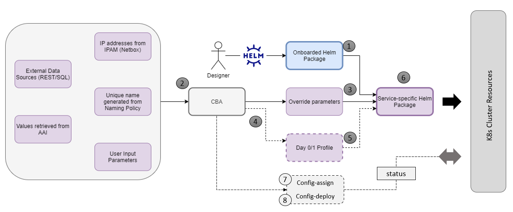

.. This work is licensed under a Creative Commons Attribution 4.0
.. International License. http://creativecommons.org/licenses/by/4.0
.. Copyright (C) 2021 Orange

vFW CNF with CDS (Use Case)
===========================

   Role of the CBA for CNF/Helm Day 0/1/2 processing

Further information about the use case, role of the CDS and all the steps required to reproduce the process can be found in the dedicated web page

:ref:`vFirewall CNF Use Case<onap-integration:docs_vFW_CNF_CDS>`

The vFW CNF use case is an official use case used for verification of the CNF Orchestration extensions.

