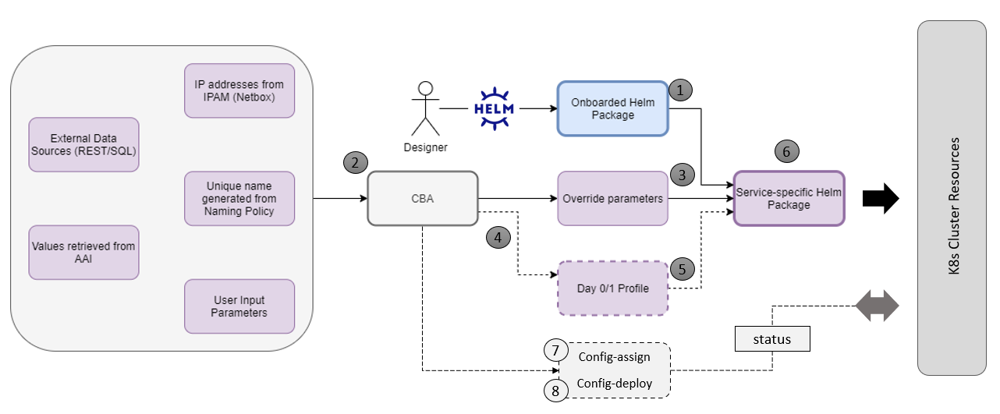
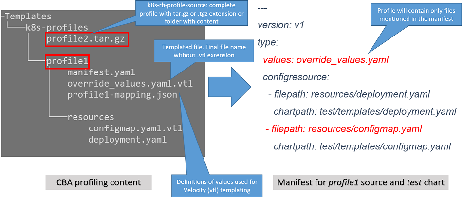

.. This work is licensed under a Creative Commons Attribution 4.0
.. International License. http://creativecommons.org/licenses/by/4.0
.. Copyright (C) 2021 Orange

vFW CNF with CDS (Use Case)
===========================

- Heat/Helm/CDS models: `vFW_CNF_CDS_Model`_

The vFW CNF use case is a demonstration of deployment of CNF application, defined as a set of Helm packages. CDS plays a crucial role in the process of CNF instantiation and is responsible for delivery of instantiation parameters, CNF customization, configuration of CBF after the deployment and may be used in the process of CNF status verification.

Base on this example there are demonstrated following features of CDS and CBA model

- resource assignment string, integer and json types
- sourcing of resolved value on vf-module level from vnf level assignment
- extracting data from AAI and MD-SAL during the resource assignment
- custom resource assignment with Kotlin script
- templating of the vtl files 
- building of imperative workflows
- utilization of on_succes and on_failure event in imperative workflow
- handling of the failure in the workflow
- implementation of custom workflow logic with Kotlin script
- example of config-assign and config-deploy operation decomposed into many steps
- complex parametrization of config deploy operation
- combination and aggregation of AAI and MD-SAL data in config-assign and config-deploy operations

The prepared CBA model demonstrates also how to utilize CNF specific features of CBA, suited for the deployment of CNF with k8splugin in ONAP:

- building and upload of k8s profile template into k8splugin
- building and upload of k8s configuration template into k8splugin
- parametrization and creation of configuration instance from configuration template
- validation of CNF status with Kotlin script

   Role of the CBA for CNF/Helm Day 0/1/2 processing

The CNF in ONAP is modeled as a collection of Helm packages, and in case of vFW use case, CNF application is split into four Helm packages to match vf-modules. For each vf-module there is own template in CBA package. The list of associated resource assignment artifacts with the templates is following:

::

    "artifacts" : {
      "helm_base_template-template" : {
        "type" : "artifact-template-velocity",
        "file" : "Templates/base_template-template.vtl"
      },
      "helm_base_template-mapping" : {
        "type" : "artifact-mapping-resource",
        "file" : "Templates/base_template-mapping.json"
      },
      "helm_vpkg-template" : {
        "type" : "artifact-template-velocity",
        "file" : "Templates/vpkg-template.vtl"
      },
      "helm_vpkg-mapping" : {
        "type" : "artifact-mapping-resource",
        "file" : "Templates/vpkg-mapping.json"
      },
      "helm_vfw-template" : {
        "type" : "artifact-template-velocity",
        "file" : "Templates/vfw-template.vtl"
      },
      "helm_vfw-mapping" : {
        "type" : "artifact-mapping-resource",
        "file" : "Templates/vfw-mapping.json"
      },
      "vnf-template" : {
        "type" : "artifact-template-velocity",
        "file" : "Templates/vnf-template.vtl"
      },
      "vnf-mapping" : {
        "type" : "artifact-mapping-resource",
        "file" : "Templates/vnf-mapping.json"
      },
      "helm_vsn-template" : {
        "type" : "artifact-template-velocity",
        "file" : "Templates/vsn-template.vtl"
      },
      "helm_vsn-mapping" : {
        "type" : "artifact-mapping-resource",
        "file" : "Templates/vsn-mapping.json"
      }
    }

SO requires for instantiation name of the profile in the parameter: *k8s-rb-profile-name* and name of the release of thr application: *k8s-rb-instance-release-name*. The latter one, when not specified, will be replaced with combination of profile name and vf-module-id for each Helm instance/vf-module instantiated. Both values can be found in vtl templates dedicated for vf-modules.

CBA offers possibility of the automatic generation and upload to multicloud/k8s plugin the RB profile content. RB profile is required if you want to deploy your CNF into k8s namesapce other than *default*. Also, if you want to ensure particular templating of your Helm charts, specific to particular version of the cluster into which Helm packages will deployed on, profile is used to specify the version of your cluster. 

RB profile can be used to enrich or to modify the content of the original helm package. Profile can be also used to add additional k8s helm templates for helm installation or can be used to modify existing k8s helm templates for each create CNF instance. It opens another level of CNF customization, much more than customization of the Helm package with override values. K8splugin offers also *default* profile without content, for default namespace and default cluster version.

::

  ---
  version: v1
  type:
    values: "override_values.yaml"
    configresource:
      - filepath: resources/deployment.yaml
        chartpath: templates/deployment.yaml

Above we have exemplary manifest file of the RB profile. Since Frankfurt *override_values.yaml* file does not need to be used as instantiation values are passed to the plugin over Instance API of k8s plugin. In the example, profile contains additional k8s Helm template which will be added on demand to the helm package during its installation. In our case, depending on the SO instantiation request input parameters, vPGN helm package can be enriched with additional ssh service. Such service will be dynamically added to the profile by CDS and later on CDS will upload whole custom RB profile to multicloud/k8s plugin.

In order to support generation and upload of profile, our vFW CBA model has enhanced **resource-assignment** workflow which contains additional step: **profile-upload**. It leverages dedicated functionality introduced in Guilin release that can be used to upload predefined profile or to generate and upload content of the profile with Velocity templating mechanism.

::

    "resource-assignment": {
        "steps": {
            "resource-assignment": {
                "description": "Resource Assign Workflow",
                "target": "resource-assignment",
                "activities": [
                    {
                        "call_operation": "ResourceResolutionComponent.process"
                    }
                ],
                "on_success": [
                    "profile-upload"
                ]
            },
            "profile-upload": {
                "description": "Generate and upload K8s Profile",
                "target": "k8s-profile-upload",
                "activities": [
                    {
                        "call_operation": "ComponentScriptExecutor.process"
                    }
                ]
            }
        },

In our example for vPKG helm package we may select *vfw-cnf-cds-vpkg-profile* profile that is included into CBA as a folder. Profile generation step uses Velocity templates processing embedded CDS functionality on its basis ssh port number (specified in the SO request as *vpg-management-port*).

::

    {
        "name": "vpg-management-port",
        "property": {
            "description": "The number of node port for ssh service of vpg",
            "type": "integer",
            "default": "0"
        },
        "input-param": false,
        "dictionary-name": "vpg-management-port",
        "dictionary-source": "default",
        "dependencies": []
    }

*vpg-management-port* can be included directly into the helm template and such template will be included into vPKG helm package in time of its instantiation.

::

  apiVersion: v1
  kind: Service
  metadata:
    name: {{ .Values.vpg_name_0 }}-ssh-access
    labels:
      vnf-name: {{ .Values.vnf_name }}
      vf-module-name: {{ .Values.vpg_name_0 }}
      release: {{ .Release.Name }}
      chart: {{ .Chart.Name }}
  spec:
    type: NodePort
    ports:
      - port: 22
        nodePort: ${vpg-management-port}
    selector:
      vf-module-name: {{ .Values.vpg_name_0 }}
      release: {{ .Release.Name }}
      chart: {{ .Chart.Name }}

The mechanism of profile generation and upload requires specific node teamplate in the CBA definition. In our case, it comes with the declaration of two profiles: one static *vfw-cnf-cds-base-profile* in a form of an archive and the second complex *vfw-cnf-cds-vpkg-profile* in a form of a folder for processing and profile generation. Below is the example of the definition of node type for execution of the profile upload operation.

::

    "k8s-profile-upload": {
        "type": "component-k8s-profile-upload",
        "interfaces": {
            "K8sProfileUploadComponent": {
                "operations": {
                    "process": {
                        "inputs": {
                            "artifact-prefix-names": {
                                "get_input": "template-prefix"
                            },
                            "resource-assignment-map": {
                                "get_attribute": [
                                    "resource-assignment",
                                    "assignment-map"
                                ]
                            }
                        }
                    }
                }
            }
        },
        "artifacts": {
            "vfw-cnf-cds-base-profile": {
                "type": "artifact-k8sprofile-content",
                "file": "Templates/k8s-profiles/vfw-cnf-cds-base-profile.tar.gz"
            },
            "vfw-cnf-cds-vpkg-profile": {
                "type": "artifact-k8sprofile-content",
                "file": "Templates/k8s-profiles/vfw-cnf-cds-vpkg-profile"
            },
            "vfw-cnf-cds-vpkg-profile-mapping": {
                "type": "artifact-mapping-resource",
                "file": "Templates/k8s-profiles/vfw-cnf-cds-vpkg-profile/ssh-service-mapping.json"
            }
        }
    }

Artifact file determines a place of the static profile or the content of the complex profile. In the latter case we need a pair of profile folder and mapping file with a declaration of the parameters that CDS needs to resolve first, before the Velocity templating is applied to the .vtl files present in the profile content. After Velocity templating the .vtl extensions will be dropped from the file names. The embedded mechanism will include in the profile only files present in the profile MANIFEST file that needs to contain the list of final names of the files to be included into the profile. 

The figure below shows the idea of profile templating.

   K8s Profile Templating

The *component-k8s-profile-upload* that stands behind the profile uploading mechanism has input parameters that can be passed directly (checked in the first order) or can be taken from the *resource-assignment-map* parameter which can be a result of associated *component-resource-resolution* result, like in our case their values are resolved on vf-module level resource assignment. The *component-k8s-profile-upload* inputs are following:

- k8s-rb-definition-name [string] - (mandatory) the name under which RB definition was created - **VF Module Model Invariant ID** in ONAP
- k8s-rb-definition-version [string] - (mandatory) the version of created RB definition name - **VF Module Model Customization ID**  in ONAP
- k8s-rb-profile-name [string] - (mandatory) the name of the profile under which it will be created in k8s plugin. Other parameters are required only when profile must be uploaded because it does not exist yet
- k8s-rb-profile-source [string] - the source of profile content - name of the artifact of the profile. If missing *k8s-rb-profile-name* is treated as a source
- k8s-rb-profile-namespace [string] - (mandatory) the k8s namespace name associated with profile being created
- k8s-rb-profile-kubernetes-version [string] - the version of the cluster on which application will be deployed - it may impact the helm templating process like selection of the api versions for resources so it should match the version of k8s cluster in which resources are bing deployed.
- k8s-rb-profile-labels [json] - the extra labels (label-name: label-value) to add for each k8s resource created for CNF in the k8s cluster (since Jakarta release).
- k8s-rb-profile-extra-types [list<json>] - the list of extra k8s types that should be returned by StatusAPI. It may be usefull when k8s resources associated with CNF instance are created outside of the helm package (i.e. by k8s operator) but should be treated like resources of CNF. To make it hapens such resources should have the instance label *k8splugin.io/rb-instance-id* what may be assured by such tools like *kyverno*. Each extra type json object needs *Group*, *Version* and *Kind* attributes. (since Jakarta release).
- resource-assignment-map [json] - result of the associated resource assignment step - it may deliver values of inputs if they are not specified directly
- artifact-prefix-names [list<string>] - (mandatory) the list of artifact prefixes like for resource-assigment step in the resource-assigment workflow or its subset

In the SO request user can pass parameter of name *k8s-rb-profile-name* which in our case may have value: *vfw-cnf-cds-base-profile*, *vfw-cnf-cds-vpkg-profile* or *default*. The *default* profile does not contain any content inside and allows instantiation of CNF without the need to define and upload any additional profiles. *vfw-cnf-cds-vpkg-profile* has been prepared to test instantiation of the second modified vFW CNF instance.

K8splugin allows to specify override parameters (similar to --set behavior of helm client) to instantiated resource bundles. This allows for providing dynamic parameters to instantiated resources without the need to create new profiles for this purpose. This mechanism should be used with *default* profile but may be used also with any custom profile. 

The overall flow of helm overrides parameters processing is visible on following figure. When *rb definition* (helm package) is being instantiated for specified *rb profile* K8splugin combines override values from the helm package, *rb profile* and from the instantiation request - in the respective order. It means that the value from the instantiation request (SO request input or CDS resource assignment result) has a precedence over the value from the *rb profile* and value from the *rb profile* has a precedence over the helm package default override value. Similarly, profile can contain resource files that may extend or ammend the existing files for the original helm package content.

   The overall flow of helm data processing

Both profile content (4) like the instantiation request values (5) can be generated during the resource assignment process according to its definition for CBA associated with helm package. CBA may generate i.e. names, IP addresses, ports and can use this information to produce the *rb-profile* (3) content. Finally, all three sources of override values, temnplates and additional resources files are merged together (6) by K8splugin in the order exaplained before.

Besides the deployment of Helm application the CBA of vFW demonstrates also how to use deicated features for config-assign (7) and config-deploy (8) operations. In the use case, *config-assign* and *config-deploy* operations deal mainly with creation and instantiation of configuration template for k8s plugin. The configuration template has a form of Helm package. When k8s plugin instantiates configuration, it creates or may replace existing resources deployed on k8s cluster. In our case the configuration template is used to provide alternative way of upload of the additional ssh-service but it coud be used to modify configmap of vfw or vpkg vf-modules.

In order to provide configuration instantiation capability standard *config-assign* and *config-deploy* workflows have been changed into imperative workflows with first step responsible for collection of information for configuration templating and configuration instantiation. The source of data for this operations is AAI, MDSAL with data for vnf and vf-modules as *config-assign* and *config-deploy* does not receive dedicated input parameters from SO. In consequence both operations need to source from *resource-assignment* phase and data placed in the AAI and MDSAL.

vFW CNF *config-assign* workflow is following:

:: 

    "config-assign": {
        "steps": {
            "config-setup": {
                "description": "Gather necessary input for config template upload",
                "target": "config-setup-process",
                "activities": [
                    {
                        "call_operation": "ResourceResolutionComponent.process"
                    }
                ],
                "on_success": [
                    "config-template"
                ]
            },
            "config-template": {
                "description": "Generate and upload K8s config template",
                "target": "k8s-config-template",
                "activities": [
                    {
                        "call_operation": "K8sConfigTemplateComponent.process"
                    }
                ]
            }
        },

vFW CNF *config-deploy* workflow is following:

::

    "config-deploy": {
        "steps": {
            "config-setup": {
                "description": "Gather necessary input for config init and status verification",
                "target": "config-setup-process",
                "activities": [
                    {
                        "call_operation": "ResourceResolutionComponent.process"
                    }
                ],
                "on_success": [
                    "config-apply"
                ]
            },
            "config-apply": {
                "description": "Activate K8s config template",
                "target": "k8s-config-apply",
                "activities": [
                    {
                        "call_operation": "K8sConfigTemplateComponent.process"
                    }
                ],
                "on_success": [
                    "status-verification-script"
                ]
            },

In our example configuration template for vFW CNF is a helm package that contains the same resource that we can find in the vPKG *vfw-cnf-cds-vpkg-profile* profile - extra ssh service. This helm package contains Helm encapsulation for ssh-service and the values.yaml file with declaration of all the inputs that may parametrize the ssh-service. The configuration templating step leverages the *component-k8s-config-template* component that prepares the configuration template and uploads it to k8splugin. In consequence, it may be used later on for instatiation of the configuration. 

In this use case we have two options with *ssh-service-config* and *ssh-service-config-customizable* as a source of the same configuration template. In consequence, or we take a complete template or we have have the templatefolder with the content of the helm package and CDS may perform dedicated resource resolution for it with templating of all the files with .vtl extensions. The process is very similar to the one describe for profile upload functionality. 

::

    "k8s-config-template": {
        "type": "component-k8s-config-template",
        "interfaces": {
            "K8sConfigTemplateComponent": {
                "operations": {
                    "process": {
                        "inputs": {
                            "artifact-prefix-names": [
                                "helm_vpkg"
                            ],
                            "resource-assignment-map": {
                                "get_attribute": [
                                    "config-setup-process",
                                    "",
                                    "assignment-map",
                                    "config-deploy",
                                    "config-deploy-setup"
                                ]
                            }
                        }
                    }
                }
            }
        },
        "artifacts": {
            "ssh-service-config": {
                "type": "artifact-k8sconfig-content",
                "file": "Templates/k8s-configs/ssh-service.tar.gz"
            },
            "ssh-service-config-customizable": {
                "type": "artifact-k8sconfig-content",
                "file": "Templates/k8s-configs/ssh-service-config"
            },
            "ssh-service-config-customizable-mapping": {
                "type": "artifact-mapping-resource",
                "file": "Templates/k8s-configs/ssh-service-config/ssh-service-mapping.json"
            }
        }
    }

The *component-k8s-config-template* that stands behind creation of configuration template has input parameters that can be passed directly (checked in the first order) or can be taken from the *resource-assignment-map* parameter which can be a result of associated *component-resource-resolution* result, like in vFW CNF use case their values are resolved on vf-module level dedicated for *config-assign* and *config-deploy* resource assignment step. The *component-k8s-config-template* inputs are following:

- k8s-rb-definition-name [string] - (mandatory) the name under which RB definition was created - **VF Module Model Invariant ID** in ONAP
- k8s-rb-definition-version [string] - (mandatory) the version of created RB definition name - **VF Module Model Customization ID**  in ONAP
- k8s-rb-config-template-name [string] - (mandatory) the name of the configuration template under which it will be created in k8s plugin. Other parameters are required only when configuration template must be uploaded because it does not exist yet
- k8s-rb-config-template-source [string] - the source of config template content - name of the artifact of the configuration template. When missing, the main definition helm package will be used as a configuration template source (since Jakarta release).
- resource-assignment-map [json] - result of the associated resource assignment step - it may deliver values of inputs if they are not specified directly
- artifact-prefix-names [list<string>] - (mandatory) the list of artifact prefixes like for resource-assigment step in the resource-assigment workflow or its subset

In our case the *component-k8s-config-template* component receives all the inputs from the dedicated resource-assignment process  *config-setup* that is responsible for resolution of all the inputs for configuration templating. This process generates data for *helm_vpkg* prefix and such one is specified in the list of prefixes of the configuration template component. It means that configuration template will be prepared only for vPKG function.

::

    "k8s-config-apply": {
        "type": "component-k8s-config-value",
        "interfaces": {
            "K8sConfigValueComponent": {
                "operations": {
                    "process": {
                        "inputs": {
                            "artifact-prefix-names": [
                                "helm_vpkg"
                            ],
                            "k8s-config-operation-type": "create",
                            "resource-assignment-map": {
                                "get_attribute": [
                                    "config-setup-process",
                                    "",
                                    "assignment-map",
                                    "config-deploy",
                                    "config-deploy-setup"
                                ]
                            }
                        }
                    }
                }
            }
        },
        "artifacts": {
            "ssh-service-default": {
                "type": "artifact-k8sconfig-content",
                "file": "Templates/k8s-configs/ssh-service-config/values.yaml"
            },
            "ssh-service-config": {
                "type": "artifact-k8sconfig-content",
                "file": "Templates/k8s-configs/ssh-service-values/values.yaml.vtl"
            },
            "ssh-service-config-mapping": {
                "type": "artifact-mapping-resource",
                "file": "Templates/k8s-configs/ssh-service-values/ssh-service-mapping.json"
            }
        }
    }

The *component-k8s-config-value* that stands behind creation of configuration instance has input parameters that can be passed directly (checked in the first order) or can be taken from the *resource-assignment-map* parameter which can be a result of associated *component-resource-resolution* result, like in vFW CNF use case their values are resolved on vf-module level dedicated for *config-assign* and *config-deploy*'s' resource-assignment step. The *component-k8s-config-value* inputs are following:

- k8s-rb-config-name [string] - (mandatory) the name of the configuration template under which it will be created in k8s plugin. Other parameters are required only when configuration template must be uploaded because it does not exist yet
- k8s-rb-config-template-name [string] - (mandatory) the name of the configuration template under which it will be created in k8s plugin. Other parameters are required only when configuration template must be uploaded because it does not exist yet
- k8s-rb-config-value-source [string] - the source of config template content - name of the artifact of the configuration template. If missing *k8s-rb-config-name* is treated as a source
- k8s-rb-config-version [string] - the version of the configuration to restore during the *rollback* operation. First configuratino after *create* has version *1* and new ones, after *update* will have version of the following numbers. When *rollback* operation is performed all previous versions on the path to the desired one are being restored one, by one. (since Jakarta)
- k8s-instance-id [string] - (mandatory) the identifier of the rb instance for which the configuration should be applied
- k8s-config-operation-type [string] - the type of the configuration operation to perform: *create*, *update*, *rollback*, *delete* or *delete_config*. By default *create* operation is performed. *rollback* and *delete_config* types are present since Jakarta release. The *update* operation creates new version of the configuration. *delete* operation creates also new version of configuratino that deletes all the resources in k8s from the cluster. *delete_config* operation aims to delete configuration entirely but it does not delete or update any resources associated with the configuration.
- resource-assignment-map [json] - result of the associated resource assignment step - it may deliver values of inputs if they are not specified directly
- artifact-prefix-names [list<string>] - (mandatory) the list of artifact prefixes like for resource-assigment step in the resource-assigment workflow or its subset

Like for the configuration template, the *component-k8s-config-value* component receives all the inputs from the dedicated resource-assignment process *config-setup* that is responsible for resolution of all the inputs for configuration. This process generates data for *helm_vpkg* prefix and such one is specified in the list of prefixes of the configuration values component. It means that configuration instance will be created only for vPKG function (component allows also update or delete of the configuration but in the vFW CNF case it is used only to create configuration instance). 

CBA of vFW CNF use case is already enriched and VSP of vFW CNF has CBA included inside. In conequence, when VSP is being onboarded and service is being distributed, CBA is uploaded into CDS. Anyway, CDS contains in the starter dictionary all data dictionary values used in the use case and enrichment of CBA should work as well.

.. note:: The CBA for this use case is already enriched and there is no need to perform enrichment process for it. It is also automatically uploaded into CDS in time of the model distribution from the SDC.

Further information about the use case, role of the CDS and all the steps required to reproduce the process can be found in the dedicated web page

:ref:`vFirewall CNF Use Case<onap-integration:docs_vFW_CNF_CDS>`

The vFW CNF use case is an official use case used for verification of the CNF Orchestration extensions.

.. _vFW_CNF_CDS_Model: https://git.onap.org/demo/tree/heat/vFW_CNF_CDS/templates?h=honolulu