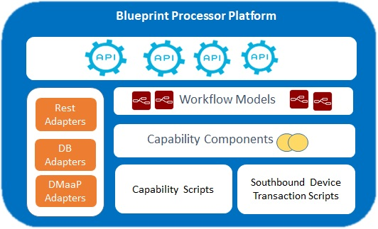

.. This work is licensed under a Creative Commons Attribution 4.0
.. International License. http://creativecommons.org/licenses/by/4.0
.. Copyright (C) 2020 Deutsche Telekom AG.

Developer Guide
=================

Blueprints Processor Microservice:
----------------------------------

Micro service to Manage Controller Blueprint Models, such as Resource Dictionary, Service Models, Velocity Templates etc,  which will serve service for Controller Design Studio and Controller runtimes.

This microservice is used to deploy Controller Blueprint Archive file in Run time database. This also helps to test the Valid CBA.

.. toctree::
   :maxdepth: 1

   running-bp-processor-in-ide

Architecture:
~~~~~~~~~~~~~

|image0|

Testing in local environment:
-----------------------------

Point your browser to http://localhost:8000/api/v1/execution-service/ping (please note that the port is 8000, not 8080)

To authenticate, use ccsdkapps/ccsdkapps login user id and password.