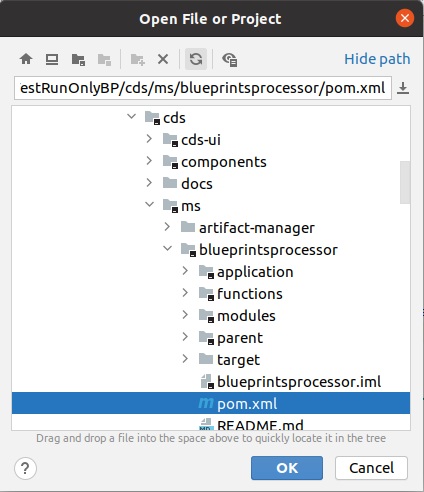

.. This work is a derivative of https://wiki.onap.org/display/DW/Running+Blueprints+Processor+Microservice+in+an+IDE
.. This work is licensed under a Creative Commons Attribution 4.0
.. International License. http://creativecommons.org/licenses/by/4.0
.. Copyright (C) 2020 Deutsche Telekom AG.

.. _running_bp_processor_in_ide:

Running Blueprints Processor Microservice in an IDE
====================================================

Objective
~~~~~~~~~~~~

Run the blueprint processor locally in an IDE, while having the database running in a container.
This way, code changes can be conveniently tested and debugged.

Check out the code
~~~~~~~~~~~~~~~~~~~

Check out the code from Gerrit: https://gerrit.onap.org/r/#/admin/projects/ccsdk/cds

Build it locally
~~~~~~~~~~~~~~~~~~

In the checked out directory, type

.. code-block:: bash

   mvn clean install -Pq -Dadditionalparam=-Xdoclint:none

.. note::
   If an error ``invalid flag: --release`` appears when executing the maven install command, you need to upgrade Java version of your local
   Maven installation. Use something like ``export JAVA_HOME=/usr/lib/jvm/java-11-openjdk-amd64``.

Wait for the maven install command to finish until you go further.

Spin up a Docker container with the database
~~~~~~~~~~~~~~~~~~~~~~~~~~~~~~~~~~~~~~~~~~~~~~

The Blueprints Processor project uses a database to store information about the blueprints
and therefore it needs to be online before attempting to run it.

One way to create the database is by using the :file:`docker-compose.yaml` file.
This database will require a local directory to mount a volume, therefore before running docker-compose create following directory:

.. code-block:: bash

   mkdir -p -m 755 /opt/app/cds/mysql/data

Navigate to the docker-compose file in the distribution module:

.. tabs::

   .. group-tab:: Frankfurt - Latest

      .. code-block:: bash

         cd ms/blueprintsprocessor/application/src/main/dc

   .. group-tab:: El Alto - Dublin

      .. code-block:: bash

         ms/blueprintsprocessor/distribution/src/main/dc

And run docker-composer:

.. code-block:: bash

    docker-compose up -d db

This should spin up a container of the MariaDB image in the background.
To check if it has worked, this command can be used:

.. code-block:: bash

    docker-compose logs -f

The phrase ``mysqld: ready for connections`` indicates that the database was started correctly.

From now on, the Docker container will be available on the computer; if it ever gets stopped,
it can be started again by the command:

.. code-block:: bash

   docker start <id of mariadb container>

Set permissions on the local file system
~~~~~~~~~~~~~~~~~~~~~~~~~~~~~~~~~~~~~~~~~~

Blueprints processor uses the local file system for some operations and, therefore,
need some existing and accessible paths to run properly.

Execute the following commands to create the needed directories, and grant access to the current user to modify them:

.. code-block:: bash

   mkdir -p -m 755 /opt/app/onap/blueprints/archive
   mkdir -p -m 755 /opt/app/onap/blueprints/deploy
   mkdir -p -m 755 /opt/app/onap/scripts
   sudo chown -R $(id -u):$(id -g) /opt/app/onap/

Import the project into the IDE
~~~~~~~~~~~~~~~~~~~~~~~~~~~~~~~~~~

.. tabs::

   .. tab:: IntelliJ IDEA

      .. note::
         This is the recommended IDE for running CDS blueprint processor.

      Go to *File | Open* and choose the :file:`pom.xml` file of the cds/ms/blueprintprocessor directory:

      |imageImportProject|

      Import as a project. Sometimes it may be necessary to reimport Maven project, e.g. if some dependencies can't be found:

      |imageReimportMaven|

      **Override some application properties:**

      Next steps will create a run configuration profile overriding some application properties with custom values,
      to reflect the local environment characteristics.

      .. tabs::

         .. group-tab:: Frankfurt - Latest

            Navigate to the main class of the Blueprints Processor, the BlueprintProcessorApplication class:

            ``ms/blueprintsprocessor/application/src/main/kotlin/org/onap/ccsdk/cds/blueprintsprocessor/BlueprintProcessorApplication.kt``.

            After dependencies are imported and indexes are set up you will see a green arrow
            next to main function of BlueprintProcessorApplication class, indicating that the run configuration can now be
            created. Right-click inside the class at any point to load the context menu and select create
            a run configuration from context:

            |imageCreateRunConfigKt|

            **The following window will open:**

            |imageRunConfigKt|

            **Add the following in the field `VM Options`:**

            .. code-block:: bash
               :caption: **Custom values for properties**

               -Dspring.profiles.active=dev

            Optional: You can override any value from **application-dev.properties** file here. In this case use the following pattern:

            .. code-block:: java

               -D<application-dev.properties key>=<application-dev.properties value>

         .. group-tab:: El Alto

            Navigate to the main class of the Blueprints Processor, the BlueprintProcessorApplication class:

            ``ms/blueprintsprocessor/application/src/main/java/org/onap/ccsdk/cds/blueprintsprocessor/BlueprintProcessorApplication.java.``

            After dependencies are imported and indexes are set up you will see a green arrow
            next to main function of BlueprintProcessorApplication class, indicating that the run configuration can now be
            created. Right-click inside the class at any point to load the context menu and select create
            a run configuration from context:

            |imageCreateRunConfigJava|

            **The following window will open:**

            |imageRunConfigJava|

            **Add the following in the field `VM Options`:**

            .. code-block:: bash
               :caption: **Custom values for properties**

               -Dspring.profiles.active=dev

            Optional: You can override any value from **application-dev.properties** file here. In this case use the following pattern:

            .. code-block:: java

               -D<application-dev.properties key>=<application-dev.properties value>

         .. group-tab:: Dublin

            Navigate to the main class of the Blueprints Processor, the BlueprintProcessorApplication class:

            ``ms/blueprintsprocessor/application/src/main/java/org/onap/ccsdk/cds/blueprintsprocessor/BlueprintProcessorApplication.java``.

            After dependencies are imported and indexes are set up you will see a green arrow
            next to main function of BlueprintProcessorApplication class, indicating that the run configuration can now be
            created. Right-click inside the class at any point to load the context menu and select create
            a run configuration from context:

            |imageCreateRunConfigJava|

            **The following window will open:**

            |imageRunConfigJava|

            **Add the following in the field `VM Options`**

            .. code-block:: java
               :caption: **Custom values for properties**

               -DappName=ControllerBluePrints
               -Dms_name=org.onap.ccsdk.apps.controllerblueprints
               -DappVersion=1.0.0
               -Dspring.config.location=opt/app/onap/config/
               -Dspring.datasource.url=jdbc:mysql://127.0.0.1:3306/sdnctl
               -Dspring.datasource.username=sdnctl
               -Dspring.datasource.password=sdnctl
               -Dcontrollerblueprints.loadInitialData=true
               -Dblueprintsprocessor.restclient.sdncodl.url=http://localhost:8282/
               -Dblueprintsprocessor.db.primary.url=jdbc:mysql://localhost:3306/sdnctl
               -Dblueprintsprocessor.db.primary.username=sdnctl
               -Dblueprintsprocessor.db.primary.password=sdnctl
               -Dblueprintsprocessor.db.primary.driverClassName=org.mariadb.jdbc.Driver
               -Dblueprintsprocessor.db.primary.hibernateHbm2ddlAuto=update
               -Dblueprintsprocessor.db.primary.hibernateDDLAuto=none
               -Dblueprintsprocessor.db.primary.hibernateNamingStrategy=org.hibernate.cfg.ImprovedNamingStrategy
               -Dblueprintsprocessor.db.primary.hibernateDialect=org.hibernate.dialect.MySQL5InnoDBDialect
               -Dblueprints.processor.functions.python.executor.executionPath=./components/scripts/python/ccsdk_blueprints
               -Dblueprints.processor.functions.python.executor.modulePaths=./components/scripts/python/ccsdk_blueprints,./components/scripts/python/ccsdk_netconf,./components/scripts/python/ccsdk_restconf
               -Dblueprintsprocessor.restconfEnabled=true
               -Dblueprintsprocessor.restclient.sdncodl.type=basic-auth
               -Dblueprintsprocessor.restclient.sdncodl.url=http://localhost:8282/
               -Dblueprintsprocessor.restclient.sdncodl.username=admin
               -Dblueprintsprocessor.restclient.sdncodl.password=Kp8bJ4SXszM0WXlhak3eHlcse2gAw84vaoGGmJvUy2U
               -Dblueprintsprocessor.grpcEnable=false
               -Dblueprintsprocessor.grpcPort=9111
               -Dblueprintsprocessor.blueprintDeployPath=/opt/app/onap/blueprints/deploy
               -Dblueprintsprocessor.blueprintArchivePath=/opt/app/onap/blueprints/archive
               -Dblueprintsprocessor.blueprintWorkingPath=/opt/app/onap/blueprints/work
               -Dsecurity.user.password={bcrypt}$2a$10$duaUzVUVW0YPQCSIbGEkQOXwafZGwQ/b32/Ys4R1iwSSawFgz7QNu
               -Dsecurity.user.name=ccsdkapps
               -Dblueprintsprocessor.messageclient.self-service-api.kafkaEnable=false
               -Dblueprintsprocessor.messageclient.self-service-api.topic=producer.t
               -Dblueprintsprocessor.messageclient.self-service-api.type=kafka-basic-auth
               -Dblueprintsprocessor.messageclient.self-service-api.bootstrapServers=127.0.0.1:9092
               -Dblueprintsprocessor.messageclient.self-service-api.consumerTopic=receiver.t
               -Dblueprintsprocessor.messageclient.self-service-api.groupId=receiver-id
               -Dblueprintsprocessor.messageclient.self-service-api.clientId=default-client-id
               -Dspring.profiles.active=dev
               -Dblueprintsprocessor.httpPort=8080
               -Dserver.port=55555

      **In the field 'Working Directory' browse to your application path**  ``.../cds/ms/blueprintsprocessor/application``
      **if path is not already specified correctly.**

      Run configuration should now look something like this:

      |imageRunConfigSetUp|

      **Add/replace the following in Blueprint's application-dev.properties file.**

      .. code-block:: java

         blueprintsprocessor.grpcclient.remote-python.type=token-auth
         blueprintsprocessor.grpcclient.remote-python.host=localhost
         blueprintsprocessor.grpcclient.remote-python.port=50051
         blueprintsprocessor.grpcclient.remote-python.token=Basic Y2NzZGthcHBzOmNjc2RrYXBwcw==

         blueprintprocessor.remoteScriptCommand.enabled=true

      Take care that if a parameter already exist you need to change the value of the existing parameter to avoid duplicates.

      **Run the application:**

      Before running Blueprint Processor check that you use the correct Java version in IntelliJ.
      Select either run or debug for the created Run Configuration to start the Blueprints Processor:

      |imageRunDebug|

      |imageBuildLogs|

   .. tab:: Visual Studio Code

      .. tabs::

         .. group-tab:: Frankfurt - Latest

            * **Step #1** - Make sure your installation of Visual Studio Code is up to date. This guide was writen using version 1.48
            * **Step #2** - Install `Kotlin extension from the Visual Studio Code Marketplace <https://marketplace.visualstudio.com/items?itemName=fwcd.kotlin>`_
            * **Step #3** - On the top menu click *Run | Open Configurations*

            .. warning:: This should open the file called `launch.json` but in some cases you'll need to wait for the Kotlin Language Server to be installed before you can do anything.
               Please watch the bottom bar in Visual Studio Code for messages about things getting installed.

            * **Step #4** - add configuration shown below to your configurations list.

            .. code-block:: json

               {
                 "type": "kotlin",
                 "request": "launch",
                 "name": "Blueprint Processor",
                 "projectRoot": "${workspaceFolder}/ms/blueprintsprocessor/application",
                 "mainClass": "-Dspring.profiles.active=dev org.onap.ccsdk.cds.blueprintsprocessor.BlueprintProcessorApplicationKt"
               }

            .. warning:: The `projectRoot` path assumes that you created your Workspace in the main CDS repository folder. If not - please change the path accordingly

            .. note:: The `mainClass` contains a spring profile param before the full class name. This is done because `args` is not supported by Kotlin launch.json configuration.
               If you have a cleaner idea how to solve this - please let us know.

            **Add/replace the following in Blueprint's application-dev.properties file:**

            .. code-block:: java

               blueprintsprocessor.grpcclient.remote-python.type=token-auth
               blueprintsprocessor.grpcclient.remote-python.host=localhost
               blueprintsprocessor.grpcclient.remote-python.port=50051
               blueprintsprocessor.grpcclient.remote-python.token=Basic Y2NzZGthcHBzOmNjc2RrYXBwcw==

               blueprintprocessor.remoteScriptCommand.enabled=true

            **Currently the following entries need to be added in VSC too:**

            .. code-block:: java

               logging.level.web=DEBUG
               logging.level.org.springframework.web: DEBUG

               #Encrypted username and password for health check service
               endpoints.user.name=eHbVUbJAj4AG2522cSbrOQ==
               endpoints.user.password=eHbVUbJAj4AG2522cSbrOQ==

               #BaseUrls for health check blueprint processor services
               blueprintprocessor.healthcheck.baseUrl=http://localhost:8080/
               blueprintprocessor.healthcheck.mapping-service-name-with-service-link=[Execution service,/api/v1/execution-service/health-check],[Resources service,/api/v1/resources/health-check],[Template service,/api/v1/template/health-check]

               #BaseUrls for health check Cds Listener services
               cdslistener.healthcheck.baseUrl=http://cds-sdc-listener:8080/
               cdslistener.healthcheck.mapping-service-name-with-service-link=[SDC Listener service,/api/v1/sdclistener/healthcheck]

               #Actuator properties
               management.endpoints.web.exposure.include=*
               management.endpoint.health.show-details=always
               management.info.git.mode=full

            In VSC the properties are read from target folder, thats why the following maven command needs to be rerun:

            .. code-block:: bash

               mvn clean install -DskipTests=true -Dmaven.test.skip=true -Dmaven.javadoc.skip=true -Dadditionalparam=-Xdoclint:none

            Click Run in Menu bar.

            |imageLogsVSC|

Testing the application
~~~~~~~~~~~~~~~~~~~~~~~

There are two main features of the Blueprints Processor that can be of interest of a developer:
blueprint publish and blueprint process.

To upload custom blueprints,  the endpoint ``api/v1/execution-service/publish`` is used.

To process, the endpoint is ``api/v1/execution-service/process``.

Postman is a software that can be used to send these request, and an example of
them is present on https://www.getpostman.com/collections/b99863b0cde7565a32fc.

A detailed description of the usage of different APIs of CDS will follow.

Possible Fixes
~~~~~~~~~~~~~~

Imported packages or annotiations are not found, Run Config not available?
*****************************************************************************

1. Rebuild with ``maven install ...`` (see above)
2. Potentially change Maven home directory in Settings
3. Maven reimport in IDE

Compilation error?
*******************
* Change Java Version to 11

.. image alignment inside tabs doesn't work

.. |imageRunConfigJava| image:: media/run_config_java.png
   :width: 500pt
   :align: middle

.. |imageRunConfigKt| image:: media/run_config_kt.png
   :width: 500pt
   :align: middle

.. |imageCreateRunConfigJava| image:: media/create_run_config_java.png
   :width: 500pt
   :align: middle

.. |imageCreateRunConfigKt| image:: media/create_run_config_kt.png
   :width: 500pt
   :align: middle

.. |imageReimportMaven| image:: media/reimport_maven.png
   :width: 400pt
   :align: middle

.. |imageRunDebug| image:: media/run_debug.png
   :width: 500pt
   :align: middle

.. |imageBuildLogs| image:: media/build_logs.png
   :width: 500pt
   :align: middle

.. |imageLogsVSC| image:: media/vsc_logs.png
   :width: 500pt
   :align: middle

.. |imageRunConfigSetUp| image:: media/run_config_set_up.png
   :width: 500pt
   :align: middle
